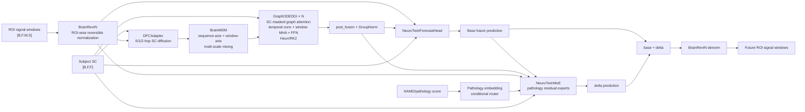
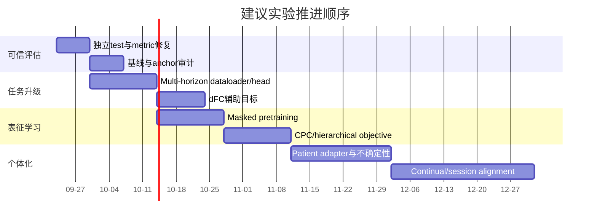

# NeuroTwin 与数字孪生脑：代码审计、文献综述与任务重构路线图

## 执行摘要

**总体判断：NeuroTwin 已经具备一个“个体条件化脑动力学预测器 / 数字孪生原型”的相当完整骨架，但按照当前数字孪生脑文献中更严格的定义，它还不能被视为已经验证的、闭环自适应的脑数字孪生系统。** 目前代码已经把被试特异的结构连接 SC、健康对照预训练、MDD 病理条件、神经动力学模块、MoE 个体化残差、虚拟干预接口等要素组织进了同一框架；但主任务仍然是**固定历史窗口 → 下一个 ROI 信号窗口的监督回归**，尚未展示持续数据同化、个体参数反演、跨时间同步、经真实干预结果验证的反事实预测，以及严格隔离的最终测试集评估。Wang 等在 2024 年给出的 Virtual Brain Twin 框架把脑孪生明确描述为“个体化、生成式、自适应”的模型，并把 subject-specific data、model inversion、forward observation model 和 intervention optimization 都视为核心元素；以此作为标尺，NeuroTwin 更接近一个有潜力成长为 digital twin 的**predictive surrogate**。citeturn22view0

从代码本身看，NeuroTwin 的技术路线并不简单。当前主干是：

**BrainRevIN → SC 多阶图扩散 DFCAdapter → 双轴多尺度 BrainMDM → SC 约束 Graph Neural ODE/Heun-RK2 → 六分支预测头 + 跨窗口注意力 + SC 迭代细化 → MDD 阶段病理条件 MoE 残差修正。** fileciteturn22file0 fileciteturn24file0 fileciteturn11file0 fileciteturn25file0

但有一个非常重要的任务定义问题：**README 将目标描述为 dFC 预测，而代码中的监督标签 `y` 实际是 `ROISignals` 的未来 ROI 信号窗口 `[F, pred_window, S]`；数据加载器和训练损失中没有显式构造或监督 dFC/FC 矩阵。** 因此，就可审计代码而言，模型目前直接解决的是“ROI 时间序列下一窗预测”，而 dFC 是潜在的隐式结构，而不是直接的监督目标。若论文的核心科学命题是“预测动态功能连接”，建议将 dFC 明确加入目标和评估，否则任务名称与实际优化目标之间存在可发表性风险。fileciteturn4file0 fileciteturn8file0 fileciteturn14file0

当前官方训练脚本实际上只运行 `pred_window=1`：`total_windows=9`、`in_window=6`、每窗 `seq_len=30`。因此每个被试只有

\[
9-6-1+1=3
\]

个监督样本：`1–6→7`、`2–7→8`、`3–8→9`。相邻输入样本重合 \(5/6=83.3\%\) 的窗口，并且一个样本的 label 会成为下一个样本的 input。由于代码默认执行 **subject-level** train/val/test 划分，这并不构成传统意义上的 train-test label leakage；但这三个样本显然不是三个独立统计样本，不能在统计检验或置信区间中按独立观测处理。fileciteturn8file0 fileciteturn9file0 fileciteturn6file0 动态 FC 文献长期指出，滑窗分析对窗口长度、滤波、重叠及非平稳性假设高度敏感，某些“动态变化”可能同时包含真实状态变化、采样波动和预处理效应。citeturn15search0turn15search5turn15search2

**目前我认为优先级最高的不是继续加大模型，而是先重构任务和评估协议。** 最先应做四件事：

1. 建立真正的一次性 held-out test evaluation，而不是继续以 validation set 作为最终分析集；当前训练入口只取 `train` 和 `val`，综合分析工具默认也构建并分析 `val_data`。**进展：分析入口已支持 `--eval_split test`（配合与训练一致的 seed/val_ratio/test_ratio/stratify_bins），可在被试级 8:1:1 留出的独立测试集上评估；训练入口自身仍只跑 train/val。**fileciteturn15file0 fileciteturn20file0 fileciteturn21file0
2. 把 `H=1` 下一窗任务升级为**直接多预测跨度 multi-horizon forecasting**，同时加入 last-window persistence、当前代码中的 linear-trend anchor、ridge/VAR、GRU/TCN/Transformer 等基线。
3. 在 HC 阶段从“纯未来原始信号回归”升级为**masked modeling + latent future prediction/CPC 的联合自监督预训练**。BENDR、BrainBERT、NDT/NDT2、EEGPT 等近年的脑信号表征研究共同支持“先学习可迁移时空表征，再做具体下游任务”的路线。citeturn22view7turn20search0turn22view5turn22view10
4. 将**显式 dFC/脑状态预测**加入辅助目标，使模型优化目标真正对齐“数字孪生脑动力学”，而不只是逐点 BOLD/ROI 信号拟合。

中长期，应把 NeuroTwin 从一次性的 HC→MDD cohort fine-tuning，扩展为**同一患者随时间持续同化、few-shot 个体适配和 intervention-conditioned forecasting**。NoMAD 在跨天神经记录上的结果说明，与其不断重训动力学模型，一个很有效的方向是保留相对稳定的 latent dynamics，再学习随 session 漂移的 observation/alignment map；这与“数字孪生持续同步”的要求高度一致。citeturn22view4 而近年的真正脑孪生临床实例已经开始要求对干预结果做外部验证，例如 2026 年 tinnitus 工作将个体模型用于大规模虚拟刺激搜索，并用独立 rTMS 数据验证预测响应。citeturn22view3

**一句话路线图：**

> **先把“下一窗预测得好”升级成“跨多个时间尺度、跨状态、跨会话、带不确定性地预测个体脑动力学”，再把“虚拟扰动”升级成“经真实干预数据验证的反事实预测”。**

## NeuroTwin 代码与任务审计

### 当前数据流与模型架构

仓库当前的顶层结构已经比较清晰，核心代码被拆分为 `models/`、`train/`、`utils/` 和 `analysis/`，预训练和微调分别有脚本入口；但 README 当前还保留了 `<<<<<<< HEAD` 一类合并冲突标记，说明文档层面的版本清理尚未完全结束。fileciteturn4file0

代码实际执行的数据—模型路径可以概括为：



`BrainRevIN` 对每个 ROI 在历史的 window × sequence 维度计算均值和标准差，并在输出时执行可逆反归一化；这些统计量在代码中 `detach`。`DFCAdapter` 对个体 SC 进行对称、非负图传播，并把 identity、1-hop、2-hop 三阶信息以可学习权重混合。`BrainMDM` 同时沿窗内序列轴和窗口轴建立卷积、池化及融合分支。fileciteturn22file0

`GraphODE` 则包含四类增量动力学：SC 约束的 ROI graph attention、局部时间卷积、窗口间 Multi-Head Attention 和 FFN；SC 同时充当 hard connectivity mask 和 `log1p(SC)` soft bias。`GraphODEDDI` 用固定步长 Heun/RK2 进行多步积分，当前脚本是 `ode_steps=6`，并加入 stochastic depth。fileciteturn24file0 因此，它可以合理地称为**neural-ODE-style dynamics block**；但需要注意，它所积分的是历史特征张量的隐空间动力学，而不是直接对连续物理时间上的未来 BOLD 状态求解，因此“ODE”目前更多是架构归纳偏置，而不是已经识别出的生理微分方程。

预测头并非简单 linear head。它并行融合六路特征：原始历史投影、latent 投影、历史时间卷积分支、history cross-ROI 分支、latent cross-ROI 分支和跨窗口 causal attention。随后分别估计 trend、standardized shape 和 positive scale，并以

\[
\hat Y=
Y_{\text{anchor}}
+Y_{\text{trend}}
+\operatorname{softplus}(s)Y_{\text{shape}}
+\Delta_{\text{SC-refine}}
\]

产生基础预测。其中 anchor 是“最后一窗 + 0.5×最近两窗差值”的外推；输出还经过三轮 SC 约束的 prediction refinement。fileciteturn11file0 fileciteturn23file0

这个 anchor 很值得单独拿出来作为基线。因为它已经向模型提供了一个很强的局部线性持久性预测；如果完整 NeuroTwin 相对于 `anchor-only` 的提升很小，那么高复杂度 GraphODE/MoE 并没有真正贡献多少可泛化动力学信息。因此我建议今后所有表格必须报告：

\[
\text{Skill}_{anchor}=1-\frac{E_{\text{NeuroTwin}}}{E_{\text{anchor}}}
\]

而不能只报告绝对 PCC/MAE。

### 数据、预处理与样本构造

当前代码明确支持两阶段数据组织：HC 用于 `pretrain`，MDD 用于 `finetune`。每位被试需要 9 个 `ROISignals_<subject>-<i>.mat` 窗口和一个 SC/Mask 矩阵；MDD 额外从 Excel 中读取 `ID` 与 `HAMD`。fileciteturn8file0

代码层面可以确认的预处理如下：

| 环节 | 当前实现 | 审计评价 |
|---|---|---|
| ROI signal | `.mat` 中二维矩阵，根据哪一维等于 `seq_len=30` 自动确定转置方向 | 仅做 layout 检查，DataLoader 本身不进行滤波、去趋势等原始 fMRI 预处理。fileciteturn8file0 |
| SC | NaN/Inf→0；对称化；负值截为 0；`log1p`；正值 99th percentile 缩放；clip 至 `[0,1]` | 合理且明确，但会改变绝对连接权重，需要 ablation。fileciteturn8file0 |
| Signal normalization | 模型内部 BrainRevIN | 只利用输入历史统计，不直接读取未来标签，设计上没有这里的 future leakage。fileciteturn22file0 |
| 数据增强 | ROI scale jitter、Gaussian noise、ROI dropout、连续 time mask | 只在 train view 启用，val/test 不增强。fileciteturn10file0 |
| MDD severity | Excel 中直接读入 HAMD float | 文件名包含 “Normalize”，但代码没有说明其归一化过程，因此**HAMD 的标准化方式未指定**。fileciteturn8file0 |
| 划分 | 默认 subject-level train/val/test；MDD 按 HAMD quantile bins 分层 | 是当前数据管线最重要的正确设计之一，可阻断同一被试进入不同集合。fileciteturn9file0 |

需要特别指出，**上游影像学预处理基本不在仓库中**。因此以下信息目前应一律标为“unspecified”，而不是从文件名或模型命名中推断：

- 被试数量、年龄/性别分布、MDD 纳排标准、扫描中心以及扫描设备；
- TR、总扫描长度、原始采样率；
- 头动校正、scrubbing、nuisance regression、global signal regression、band-pass filtering；
- ROI parcellation 的具体生成过程，虽然代码默认 116 ROI 并在分析工具中按 AAL116 解释；
- `.mat` 中 30 点窗口究竟对应多少秒；
- 原始滑动窗口的 **window length 与 stride**，特别是 9 个窗口之间是否共享原始 BOLD time points；
- SC 是 dMRI tractography、模板 SC 还是其他来源，tractography/thresholding 细节；
- MDD 是否存在多次随访扫描；
- HAMD 归一化是否仅用训练集统计量；
- 数据集是否独立于模型开发过程、是否存在外部 cohort；
- 实际训练/测试 benchmark 数值与公开 checkpoint 性能。

这些未指定项尤其影响下一节对“窗口重叠泄漏”的判断：**代码能证明的是监督样本之间复用了窗口，但不能证明原始 BOLD 样本是否在相邻 `.mat` 窗口间重复。**

### 当前监督任务的精确定义

令每位被试的数据为

\[
X_1,\dots,X_9,\qquad
X_t\in\mathbb R^{116\times30}.
\]

当前官方脚本使用：

\[
W_{\text{in}}=6,\qquad H=1.
\]

DataLoader 构造：

\[
(X_s,\ldots,X_{s+5})\rightarrow X_{s+6},
\]

其中

\[
s=1,2,3.
\]

因此：

| 样本 | 输入 | 标签 |
|---|---|---|
| A | 窗 1–6 | 窗 7 |
| B | 窗 2–7 | 窗 8 |
| C | 窗 3–8 | 窗 9 |

这意味着相邻输入的窗口级 Jaccard-like overlap 很高，简单按共同输入窗比例就是

\[
\frac{5}{6}=83.3\%.
\]

`pred_window=2` 时固定六窗输入只能得到 2 个起点；`pred_window=3` 时只剩 1 个起点。因此虽然 CLI 默认值支持更大的 `pred_window`，当前正式脚本实际只跑 `pred_window=1` 是可以理解的：固定 9 窗数据会迅速产生样本数退化。fileciteturn8file0 fileciteturn6file0 fileciteturn7file0

### 损失、训练与评估

主监督损失为四项可学习 uncertainty weighting：

\[
L_{\rm PCC}=1-\operatorname{mean}(\rho),
\]

\[
L_{\rm MAE}=\left\|\hat Y-Y\right\|_1,
\]

\[
L_{\rm diff}
=
\left\|
\Delta\operatorname{vec}(\hat Y)
-
\Delta\operatorname{vec}(Y)
\right\|_1,
\]

\[
L_{\rm std}
=
\left|
\sigma(\hat Y)-\sigma(Y)
\right|,
\]

并使用

\[
L_{\rm hybrid}
=
\sum_i
\left[
e^{-s_i}L_i+s_i
\right].
\]

fileciteturn14file0

PCC 在训练时是**每个 batch、每个 ROI**将未来 `W×S` flatten 后计算，再跨 ROI/batch 平均。MAE 约束绝对幅值，`diff` 约束短时变化，`std` 约束波动程度。fileciteturn14file0

一个值得提前修复的细节是：当未来从 `pred_window=1` 扩展到多窗时，当前 `torch.diff` 是在 flatten 后的 `W×S` 维度直接求差，因此会额外包含：

> 第 k 个窗口最后一点 → 第 k+1 个窗口第一点

这一“边界差分”。如果上游窗口是重叠滑窗，这两点甚至未必是真实相邻采样点；因此多窗口实验前应改成**窗内 diff 与跨窗 state diff 分开建模**。

训练脚本的当前典型配置为 150 epochs、batch size 32、15 epochs warmup、AdamW、cosine scheduler、AMP、EMA=0.999、gradient clipping=1.0、early stopping patience=20。HC 阶段训练全主干；MDD 阶段先冻结 backbone 10 epochs，只训练个体化 MoE，之后解冻主干，backbone learning rate scale 为 0.2。fileciteturn6file0 fileciteturn7file0 fileciteturn15file0

MoE 训练还加入 load balancing、entropy、router Z-loss 和 diversity regularization。默认 router 只依据 pathology condition，而不是脑活动本身进行专家选择；单维 pathology 输入时，HAMD 被扩展为 \(x,x^2,\sin(\pi x)\) 再映射到 embedding。fileciteturn25file0

这里存在两个重要的个体化限制。

第一，**两个 HAMD 相同但病理机制完全不同的患者，在默认 `moe_router_cond_only=True` 下具有相同的路由条件信息。** 因而“个体化”的核心路由目前主要是 severity-conditioned，而不是 patient-state-conditioned。fileciteturn16file0 fileciteturn25file0

第二，默认 `moe_use_argmax=False`，推理时仍会经过低温缩放后进行随机采样，而不是完全确定性的 top-k。fileciteturn25file0 这意味着 validation/test 指标本身可能受 router 随机性影响。对于一个被称为“数字孪生”的系统，应当二选一：**正式比较时使用 deterministic routing；或者明确把随机路由解释为 Monte-Carlo predictive uncertainty，并用重复采样报告均值、方差和校准。** 目前介于二者之间的状态不利于稳定早停和可复现实验。

评估代码比训练入口提供的指标更多：分析包支持 MAE、MSE、RMSE、PCC、R²、SMAPE、误差百分位、ROI-wise metrics、temporal variance、sample-wise PCC、MoE gate 分析、ROI permutation importance 和 FDR。fileciteturn18file0 fileciteturn19file0

但需要优先修复两个评价问题。

**其一，没有真正闭环使用 test set。** `NeuroTwinDataLoader` 明确生成 train/val/test，训练入口却只读取 `get_train()` 和 `get_val()`；综合分析工具默认构建的也是 `val_data`。因此如果目前的“最终结果”来自综合分析脚本的默认调用，它实际上仍是 development validation performance，而不是一次性冻结后的 test performance。**进展：分析入口现可通过 `--eval_split test` 在留出的 test split 上评估（划分参数须与训练一致），`metrics.json` 会记录 `eval_split`；训练入口仍不消费 test split。**fileciteturn9file0 fileciteturn15file0 fileciteturn20file0 fileciteturn21file0

**其二，当前 MASE 实现存在维度问题。** `pred/target` 的约定是 `[B,F,W,S]`，但 denominator 使用 `target[:,1:] - target[:,:-1]`；这在 Python indexing 下沿的是第二维 `F`，也就是**相邻 ROI**，而不是时间。因而当前输出的 `MASE` 不应解释为标准时间序列 MASE。fileciteturn18file0

此外，训练目标的 PCC、`sample_pcc` 和 `global PCC` 三种定义也不同：训练 PCC 是 ROI-wise；sample PCC 将一个被试样本所有 ROI 和时间 flatten；global PCC 又将全部样本 flatten。fileciteturn14file0 fileciteturn18file0 这三者可以同时报告，但不能混称“PCC”。

## 数字孪生脑与脑信号学习文献版图

### 从“脑模拟器”到“真正数字孪生”的演化

数字孪生脑研究大致正在从四个方向汇合：

**机制型 whole-brain modeling** 源自 The Virtual Brain 一类工作：把个体结构连接和局部神经群体动力学组合成全脑网络模拟器，是今天“virtual brain twin”概念的机制基础。早期 TVB 已明确将结构连接、神经质量模型和 EEG/fMRI 等 forward signals 放进统一仿真框架。citeturn1search11turn1search19

**大规模数字人脑仿真 + data assimilation** 方向以中国团队 Lu 等的 Digital Twin Brain 为代表，目标是把个体 sMRI/DTI/PET 等结构信息、全脑脉冲网络和观测数据同化放到统一高性能计算平台。citeturn22view1 Xiong 等 2023 年的观点论文则从 biological intelligence 与 artificial intelligence 的桥梁角度系统化了 “Digital Twin Brain” 概念。citeturn11search1

**临床 virtual brain twin** 越来越强调“不是把脑模拟得越细越好”，而是针对诊疗问题建立足够准确、可推断、可干预的患者特异模型。Wang、Jirsa 等 2024 年 formalize 了这一思路：个体脑空间、subject-specific connectivity、parameter inversion、forward observation 和 intervention 是完整孪生框架的关键构件。citeturn22view0 2025–2026 年的工作进一步出现了利用 ECoG 或 MRI/EEG 建立实时状态孪生和虚拟干预、再用独立真实刺激数据验证的案例。citeturn10search0turn22view3

**数据驱动 neural foundation / representation models** 则来自 LFADS、BENDR、Neural Data Transformer、BrainBERT、EEGPT 等工作。这条线未必自称 digital twin，但它解决了孪生系统必须面对的关键问题：如何从低 SNR、跨人、跨 session、跨设备的脑信号中学习稳定的 latent dynamics 和可迁移 representation。citeturn22view8turn22view7turn22view5turn20search0turn22view10

### 关键论文对比

下表选取的 11 项工作不是简单按引用量排序，而是按“对 NeuroTwin 的任务重构最有直接启发”筛选。

| 工作 | 目标 / 数据 | 核心模型 | 任务与主要评价 | 优势 | 局限 | 对 NeuroTwin 的直接意义 |
|---|---|---|---|---|---|---|
| **The Virtual Brain / Sanz Leon et al., 2013** citeturn1search11turn1search19 | 基于解剖连接构建全脑网络动力学，生成 fMRI/EEG/MEG 等 | neural mass / field + connectome | 模拟信号与经验脑活动/FC 对照；无统一 ML benchmark | 奠定 SC→dynamics→observation 的机制型框架 | 参数识别与个体预测能力受模型假设限制 | NeuroTwin 的 SC+GraphODE 可视为数据驱动版 whole-brain dynamics，但应增加显式 observation/dFC 层和参数个体化解释 |
| **LFADS, Pandarinath et al., 2018** citeturn22view8 | 猕猴和人运动皮层单试次 spike | sequential VAE + RNN dynamical generator | firing-rate inference、行为预测、扰动识别、跨 session stitching | 把“观测噪声”与“latent dynamics”明确分开；能跨月整合 session | RNN 训练复杂；面向 spike 而非 fMRI | 最重要启发是：不要只拟合下一窗原始 signal，而应显式学习低维 latent dynamics |
| **BENDR, Kostas et al., 2021** citeturn22view7 | 大规模无标签 EEG；下游 MMI、BCIC、ERN、P300、sleep 等 | CNN encoder + Transformer + contrastive SSL | 各下游 EEG 分类指标 | 单个预训练模型可迁移至不同设备、被试和任务 | EEG 与 fMRI 时间尺度不同；contrastive negatives 设计敏感 | 支持 HC 大规模自监督预训练，而非只做 supervised next-window regression |
| **Neural Data Transformer, Ye & Pandarinath, 2021** citeturn22view5 | 神经群体 spike，包含运动皮层任务 | Transformer | masked neural reconstruction / co-smoothing、行为解码 | 非 RNN 序列建模；高并行性；适合 missing/masked neural observations | attention 成本；跨 session 泛化仍需额外设计 | 支持在 NeuroTwin 中引入 masked-window/patch objective，以及将预测与 representation learning 解耦 |
| **Digital Twin Brain, Lu et al., 2023** citeturn22view1 | 个体结构影像 + 全脑尺度 spiking simulation + assimilation | whole-brain spiking network + data assimilation + HPC | 仿真脑活动与观测脑活动匹配及同化 | 中国团队中最直接的数字孪生脑工程路线之一；强调 simulation + assimilation | 计算代价极高；与轻量临床预测器定位不同 | NeuroTwin 不必复制其尺度，但应吸收“data assimilation / twin synchronization”理念 |
| **BrainBERT, Wang et al., 2023** citeturn20search0turn20search20 | 大规模无标签 intracranial field potentials；观看视频等自然任务 | reusable Transformer + SSL | 下游神经 decoding accuracy / data efficiency | 证明预训练神经表示可以显著降低下游标签需求 | invasive iEEG 与 BOLD 差异很大 | 对 MDD 小样本场景尤其有价值：先用 HC/无标签 MDD 学表示，再做病理 fine-tune |
| **Virtual brain twins, Wang et al., 2024** citeturn22view0 | 概念框架 + 多疾病 whole-brain modeling 案例 | personalized generative model + model inversion | 非单一 benchmark；强调 patient-specific inference/intervention | 当前判断一个系统是否真正“brain twin”的重要理论标尺 | 本身不是统一预测基准 | 暴露 NeuroTwin 当前最核心的缺项：online adaptation、parameter inversion、validated intervention |
| **EEGPT, Wang et al., 2024** citeturn22view10 | 大规模混合多任务 EEG | 10M Transformer；mask-based dual SSL；spatiotemporal representation alignment | 多任务 linear probing / downstream performance | 专门解决低 SNR、inter-subject variation 和 channel mismatch；空间/时间分层 | EEG modality 与 fMRI 不同 | 强烈支持“预测 raw signal 不是唯一目标”，可改为 latent target + spatiotemporal alignment |
| **NoMAD, Karpowicz et al., 2025** citeturn22view4 | 多天神经群体记录中的电极/神经表征漂移 | 固定 latent dynamics + unsupervised alignment | reconstruction/alignment loss、behavior decoding \(R^2\) | 把稳定 dynamics 与漂移 observation 分离，非常契合 longitudinal twin | 需要 longitudinal data | NeuroTwin 长期最值得借鉴的 continual-learning 思路：不重训整个 twin，只更新 alignment/adapter |
| **Digital twin brain for consciousness, Takahashi et al., 2025** citeturn10search0 | 灵长类 ECoG，清醒/麻醉状态 | hierarchical latent variational Bayesian RNN + data assimilation | 脑状态建模、实时监测和 virtual intervention | 把时序 latent model、assimilation 和虚拟干预组合起来 | 仍是灵长类 ECoG，临床转化距离较远 | 与 NeuroTwin 最相似的“预测 + 状态 + intervention”范式；说明 hierarchical timescale 很值得做 |
| **Tinnitus DTB, Zhang et al., 2026** citeturn22view3 | 89 名参与者，多模态脑影像；独立 rTMS 验证 | patient-specific dynamic model + virtual stimulation search | 虚拟刺激响应与独立真实响应关联、permutation significance | 从“模拟像不像”进一步走到“干预响应能否预测” | 疾病特异，依赖高质量 multimodal data | 这是 NeuroTwin 应追求的长期 validation 标准：真实治疗响应而非仅 next-window PCC |

两篇不放入表格但对任务设计非常重要的工作也应保留。

**Contrastive Predictive Coding（CPC）** 的关键思想不是在 observation space 逐点预测未来，而是让上下文表征预测未来 latent representation，并用对比目标区分真实未来与负样本。这尤其适合高噪声脑信号，因为很多不可预测的 observation-level variation 并不是我们真正关心的动力学。citeturn22view9

**NDT2** 则进一步将 neural Transformer 推向 multi-session / multi-subject / multi-task context pretraining，提示“被试、session、task 是 context variables，而不是必须分别训练完全独立模型”。citeturn13search2 这与 NeuroTwin 未来把 HAMD 单标量扩展为 multimodal patient context 的方向高度一致。

### 文献给 NeuroTwin 的核心启示

综合这批文献，最近五年的趋势不是“谁用的 Transformer 更大”，而是四个更根本的转变。

第一，从**直接 signal reconstruction** 转向 **latent representation / state dynamics**。LFADS 明确把 observation noise 与 latent dynamics 分开；CPC、BENDR、BrainBERT、EEGPT 则进一步表明，自监督 latent target 往往比追逐低 SNR 原始信号更具有跨任务迁移价值。citeturn22view8turn22view9turn22view7turn22view10

第二，从**单一时间尺度**转向**层级时间尺度**。脑信号至少同时存在窗内快速变化、跨窗口状态变化以及更慢的病理/意识/治疗状态漂移；EEGPT 显式区分空间和时间层次，Takahashi 等的 digital twin brain 也使用 hierarchical latent dynamics。citeturn22view10turn10search0

第三，从**一次训练完成**转向**持续同步**。真正的 twin 概念要求 model state 随 patient data 更新；NoMAD 的跨 session latent alignment 是一个很实用的机器学习版本，而 VBT 理论框架则从机制模型角度要求 subject-specific model inversion。citeturn22view4turn22view0

第四，从**预测观测值**转向**预测 intervention outcome**。这决定了一个系统是“优秀时序模型”还是“有临床意义的 twin”。2026 年 tinnitus 工作代表的正是这个方向。citeturn22view3

## 滑动窗口下一窗预测的批判性分析

### 有限上下文不等于真正的动力学状态

当前模型只看 6 个窗口。数学上：

\[
p(X_{t+1}\mid X_{t-5:t},SC,\text{HAMD})
\]

隐含了一个非常强的有限阶 Markov 假设：足以预测未来的状态全部包含在这 6 窗里。

但真实脑活动可能同时受到更慢的 arousal、motion/physiological state、疾病状态、扫描阶段、药物状态等影响。动态 FC 文献长期警告，观察到的短时变化既可能来自真实脑状态，也可能来自估计噪声及非平稳性。citeturn15search2turn15search0

在当前仓库中，BrainRevIN 能缓解每段的均值/尺度漂移，但没有显式的 long-term latent state；HAMD 又是整位患者固定的一个 scalar。因此模型能够表达的状态大体是：

> 短期历史 + 固定结构连接 + 固定病情严重度。

这和“随时间同步的 patient twin state”仍有明显距离。

### 高重叠导致 nominal sample size 被夸大

每被试 3 个样本并不等价于三个独立实验单元。相邻输入有 83.3% 的窗口完全相同，并且：

\[
Y_s=X_{s+6}
\]

会成为：

\[
X_{s+1:s+6}
\]

中的最后一个历史窗口。

这不是 train/test 泄漏，因为整个 subject 被放入同一个 split。fileciteturn9file0 但它意味着误差项必然高度相关。时间序列交叉验证理论也强调，依赖数据不能按 iid 样本直接处理。citeturn16search5

因此以下做法都不应使用：

- 把所有滑窗样本作为独立样本做普通 t-test；
- 以 `#windows` 而不是 `#subjects` 作为统计自由度；
- 从高度重叠窗口随机抽 train/test。

正式统计的最小聚类单位应是**被试**；如果存在 repeated visits，还应继续考虑 subject/session 层级。

### 真正的 raw-window leakage 风险目前无法判断

动态 FC 文献特别强调 sliding-window length 和 overlap/stride 对结果的影响。citeturn15search0turn15search5

仓库只存储预先生成的 `ROISignals_window/*.mat`，没有生成这 9 个窗口的原始代码，因此不知道：

\[
X_t \cap X_{t+1}
\]

在原始 BOLD time points 上是否为空。

例如，如果每个 30-point window 的 stride 只有 1–5 个 TR，那么“预测下一窗”实际上可能包含大量对已经出现在输入里的原始 BOLD 样本的重建；在这种情况下，下一窗任务会远比真正 future forecasting 容易。反过来，如果窗口完全不重叠，则不存在这个问题。

**因此这不是我认定已经存在的 leakage，而是目前必须审计、但仓库无法回答的关键变量。**

建议在数据 metadata 中强制记录：

\[
(\text{TR},\text{window length},\text{stride},\text{raw start index},\text{raw end index})
\]

并在 DataLoader 中直接断言 forecast target 的 raw timestamp 不与 input 相交。

### 窗口边界可能被模型误当成真实时间邻接

预测头中有一条 branch 会把 `[W,S]` flatten 为 `W×S` 后做 `Conv1d`。fileciteturn11file0

于是模型把：

\[
X_w[S]\rightarrow X_{w+1}[1]
\]

当作普通相邻序列位置。

只有在“各窗口完全不重叠、且首尾严格时间连续”的情况下，这种邻接才具有简单的时间意义。若窗口是重叠滑窗，则：

> 前一窗口的最后样本与下一窗口的第一样本，并不是原始 BOLD 序列中相邻的两个时点。

同一个问题还存在于当前 anchor：

\[
X_t + 0.5(X_t-X_{t-1})
\]

它是对不同窗口**同一位置 index** 做趋势外推。若窗口位置是滑动局部坐标，这种 position-wise trend 是否具有生理解释，需要通过 upstream stride 定义才能判断。

这并不意味着当前设计必然错误；它意味着模型同时混用了两种不同假设：

- BrainMDM / window attention：把窗口看作高层 temporal token；
- flattened Conv1d：又把各窗口拼成一个连续低层序列。

建议专门做 ablation。

### 单一一步目标天然鼓励 persistence

短期平滑脑信号非常容易出现一种现象：

\[
X_{t+1}\approx X_t.
\]

当目标只是一窗未来时，复杂网络很可能主要学习 persistence 和局部 slope，而不是长期动力学。

NeuroTwin 本身甚至显式构建了 last-window + slope anchor。fileciteturn11file0 这进一步说明，**没有 persistence/anchor baseline 就无法判断 GraphODE、SC 和 MoE 是否真正学到了额外动力学。**

推荐的最小基线集是：

| 基线 | 必须回答的问题 |
|---|---|
| `last-window persistence` | 直接复制最后一窗能做到多好？ |
| `current anchor` | NeuroTwin 现有线性 slope anchor 本身能做到多好？ |
| per-ROI AR/Ridge | 非线性模型是否超过简单自回归？ |
| VAR / low-rank VAR | cross-ROI interaction 是否真的需要深网？ |
| GRU/LSTM | GraphODE/attention 相比传统 recurrent dynamics 有何增益？ |
| TCN | 多尺度卷积是否已经足够？ |
| Transformer/Patch-style baseline | 图结构先验是否优于纯 sequence model？ |

只有当 NeuroTwin 在**较长预测跨度**仍显著超过这些 baseline，才能更有说服力地说模型学到了 brain dynamics。

### 窗口长度敏感性目前不可见

当前 `seq_len=30` 是硬编码实验配置，但 30 points 是多少秒未知。fileciteturn6file0 动态 FC 文献显示 window choice 可能显著改变估计的时间变化特征，因此一个 window size 上表现好不能自动推导到其他尺度。citeturn15search0turn15search5

至少应测试：

\[
W_{\rm context}\in\{3,4,6,8\}
\]

以及在能够重新生成 raw windows 时测试多个：

\[
L_{\rm window},\quad stride.
\]

最终最好绘制二维 sensitivity surface：

\[
\text{PCC/MAE}=f(L_{\rm window},stride).
\]

### 非平稳性没有被显式建模

当前 RevIN 能处理输入局部均值与方差漂移，但不是显式 regime-switching model。GraphODE 的 derivative 也没有外部状态变量或真实物理时间输入。fileciteturn22file0 fileciteturn24file0

可以出现：

\[
p(X_{t+1}\mid X_{1:t},z_t)
\]

中的 \(z_t\) 在扫描过程中发生变化，但模型没有直接表示 \(z_t\)。

这正是后面建议添加 latent brain state、state transition 和 hierarchical timescale objective 的原因。临床 digital twin 的最新工作也越来越关注 state-specific intervention，而不是假定一个患者只有一个固定动力学模式。citeturn22view3

### PCC 本身不足以证明数字孪生质量

训练主要按 validation `loss_pcc` 选 checkpoint。fileciteturn15file0

Pearson correlation 对线性幅值变换不敏感：

\[
\rho(y,a\hat y+b)=\rho(y,\hat y),\quad a>0.
\]

因此两个幅值和方差严重不同的预测仍可获得较好相关系数。当前 MAE/std loss 在训练层面部分修复这一点，fileciteturn14file0 但 checkpoint selection 仍只按 PCC，可能选择 correlation 更高、absolute fidelity 更差的模型。

对“数字孪生”的更合理评价至少需要同时回答：

**形状是否正确？幅值是否正确？频谱是否正确？跨 ROI 相关结构是否正确？状态转移是否正确？远期预测是否退化？不确定性是否校准？**

而不是只问 PCC。

### 现有分析存在 development-set optimization 风险

模型选择用 validation PCC；之后 comprehensive analysis 又分析 validation set。fileciteturn15file0 fileciteturn20file0

如果研究者反复根据这些结果调整模型，validation 已经逐渐成为事实上的训练反馈集。因此即使 subject 不重叠，也会产生**研究决策层面的 test contamination**。

正确流程应是：

\[
\text{Train}
\rightarrow
\text{Validation/model selection}
\rightarrow
\boxed{\text{Frozen model}}
\rightarrow
\text{Test once}
\rightarrow
\text{Report}.
\]

最终 test 的模型和分析脚本都不应再反向影响 architecture/hyperparameter。

## 替代任务设计与优先级路线

我建议不要废掉现有 architecture；恰恰相反，NeuroTwin 已有足够强的 encoder/backbone，最有价值的工作是**重新定义它学习什么**。

### 候选任务与学习目标

| 方案 | 为什么做 | 预期收益 | NeuroTwin 实现改动 | 建议评价 |
|---|---|---|---|---|
| **直接多跨度预测 Multi-horizon** | H=1 太容易退化到 persistence，不能测试长期动力学 | 测量真正的 temporal predictive horizon；减少只学 local smoothness | DataLoader 返回 `future[:Hmax] + horizon_mask`；预测头一次输出 H=1…3；按 horizon 加权 loss | 每个 horizon 的 MAE/RMSE/PCC/CCC；skill vs persistence；performance decay slope |
| **Masked window / patch prediction** | 无标签 HC/MDD 数据远多于可靠临床 target 时，监督下一窗浪费信息 | 学习 robust spatiotemporal representation；减少对下一窗特殊位置过拟合 | 全 9 窗输入；随机 mask ROI×time patch / whole window；加 mask token 和 reconstruction/latent head | masked reconstruction；linear probe；forecast fine-tune sample efficiency |
| **CPC / latent future prediction** | 原始 BOLD 含大量不可预测噪声；真正想要的是 predictive state | 强迫 latent 保留对未来有用的信息，而非逐点拟合 noise | Window encoder 得到 \(z_t\)，context 得到 \(c_t\)，predict \(z_{t+k}\)；InfoNCE | retrieval accuracy、InfoNCE、下游 multi-horizon skill |
| **层级 predictive coding** | 当前模型已有“窗内 + 窗间”两轴，但目标没有显式层级 | 同时捕获快 dynamics、window state 和慢病理状态 | 窗内 masked loss + 窗级 latent future loss + sequence-level state loss | 各尺度 probe，PSD/ACF、state transition、forecast |
| **显式 dFC auxiliary target** | 当前代码名为 dFC predictor，但实际预测 ROI signal | 使优化目标与科研叙事一致；SC→FC 关系更直接 | 对每个真实未来窗计算 FC/dFC target；增加 differentiable correlation/covariance head 或 derived loss | FC matrix correlation、edge MAE、network topology distance |
| **事件/脑状态目标** | 临床状态常比逐点波形更稳定、更可解释 | 能评价 state transition、dwell time 和异常状态预测 | 在 train-only 数据上用 HMM/clustering/LEiDA 类方法生成 state；增加 classifier/hazard head | macro-F1、AUROC、Brier score、transition accuracy、dwell-time error |
| **多任务辅助学习** | 单一 next-window objective 约束不足 | 更稳定 representation，减少 shortcut | 同时预测 raw signal、dFC、derivative、PSD、window statistics；用 uncertainty weighting/GradNorm 等平衡 | 每项指标 + representation probes + ablation |
| **few-shot patient adaptation / meta-learning** | HAMD-only router 不是充分个体化 | 让模型根据新患者少量实际动态迅速更新 | patient adapter/FiLM/LoRA-like bottleneck；episodic subject-level training；可先做 ANIL/Reptile 再考虑 MAML | 0-shot→1-shot→k-shot improvement curve |
| **continual / longitudinal assimilation** | 真正 twin 必须随 patient 新数据同步 | 对 session drift、病情演变更稳健 | 固定动力学 backbone，只更新 alignment/session adapter；必要时 replay/EWC | forgetting、forward transfer、per-session calibration、adaptation speed |
| **curriculum learning** | 一开始直接优化远期困难任务可能不稳 | 更易训练 hierarchical objectives | masked reconstruction → H1 latent prediction → H1/H2/H3 raw forecast → MDD personalization | 学习曲线、收敛速度和最终泛化 |

其中 CPC 的理论来源正是“预测未来 latent，而不是未来 observation”。citeturn22view9 BENDR 把类似 contrastive self-supervision 适配到大规模 EEG，证明单个预训练模型可以迁移到不同硬件、被试和任务；BrainBERT 与 EEGPT 进一步说明 mask-based neural representation learning 是近年脑信号建模的强方向。citeturn22view7turn20search0turn22view10

### 我最推荐的短期目标：variable-cutoff multi-horizon

简单把 `pred_window` 从 1 改成 3 会导致当前每位被试只剩 1 个样本。因此更好的设计不是：

> 固定 6 输入 + 固定 3 输出。

而是定义一个 cutoff \(c\)，让模型在一个序列不同位置预测可获得的所有未来：

\[
X_{\max(1,c-W_{\max}+1):c}
\rightarrow
\{X_{c+1},X_{c+2},X_{c+3}\}.
\]

例如 \(W_{\max}=6,H_{\max}=3\)，当未来不足三窗时用 `future_mask` 忽略不存在的 horizon。

```text
subject sequence:  X1  X2  X3  X4  X5  X6  X7  X8  X9

cutoff=3:          [ X1 X2 X3 ]  -> X4 X5 X6
cutoff=4:          [ X1..X4 ]    -> X5 X6 X7
cutoff=5:          [ X1..X5 ]    -> X6 X7 X8
cutoff=6:          [ X1..X6 ]    -> X7 X8 X9
cutoff=7:             [X2..X7]   -> X8 X9 [mask]
cutoff=8:                [X3..X8]-> X9 [mask][mask]
```

这些仍然不是独立样本，但它们在训练上提供了丰富得多的 context/horizon 组合，也能自然支持 curriculum。

建议默认 horizon 权重先设成：

\[
\lambda_1=1,\qquad
\lambda_2=0.7,\qquad
\lambda_3=0.5
\]

作为工程起点，而不是理论最优值，然后通过 validation ablation 调整。

可将损失重写成：

\[
L_{\rm forecast}
=
\frac{
\sum_{h=1}^{H_{\max}}
m_h\lambda_h
\left(
\alpha L_{\rm PCC}^{(h)}
+\beta L_{\rm MAE}^{(h)}
+\gamma L_{\rm CCC}^{(h)}
+\delta L_{\rm dFC}^{(h)}
\right)}
{\sum_h m_h\lambda_h}.
\]

这样可以直接看到模型的“predictive horizon”，而不是只得到一个 H=1 总分。

### 中期核心：Masked + CPC 联合 HC 预训练

我会把当前 HC pretraining 从：

\[
X_{1:6}\rightarrow X_7
\]

改成三目标联合：

\[
L_{\rm pretrain}
=
L_{\rm mask}
+\lambda_{\rm CPC}L_{\rm CPC}
+\lambda_{\rm forecast}L_{\rm future}.
\]

其中：

**Masked objective**：随机遮住 30%–50% 的 ROI-time patches 或部分窗口，让 backbone 恢复 masked latent/信号。

**CPC objective**：窗口 encoder 产生

\[
z_t=E(X_t,SC),
\]

历史 context 产生

\[
c_t=C(z_{\le t}),
\]

通过多个 predictor：

\[
\hat z_{t+k}=g_k(c_t),\quad k=1,2,3
\]

与真实 \(z_{t+k}\) 做 InfoNCE。CPC 之所以适合这里，是因为它允许模型忽略难以预测但无关紧要的 observation noise，而保留“对未来最有信息”的表征。citeturn22view9

建议负样本优先来自**不同被试**，并单独做“same-subject negatives / cross-subject negatives” ablation；脑信号相邻时间点高度相关，随意把同一 session 的邻近时刻当 negative 很可能制造 false negatives。

与现有代码的兼容性其实很好：

- `DFCAdapter + BrainMDM + GraphODE` 保留为 encoder；
- 增加 `window_projection_head`；
- `NeuroTwinForecastHead` 保留用于 supervised forecast；
- 加 `MaskedReconstructionHead`；
- 加 `CPCPredictor[k]`；
- HC 阶段联合训练；
- MDD 阶段先加载 encoder，再进入 pathology MoE。

这比立刻换一个更大的 Transformer 更有研究价值。

### 中期核心：把 dFC 变成真正的目标

如果项目论文要继续以“脑动态功能连接数字孪生”为核心，建议对每个 future window \(Y_h\) 显式计算：

\[
FC_h=\operatorname{Corr}(Y_h)
\in\mathbb R^{F\times F}.
\]

然后增加：

\[
L_{\rm FC}
=
1-\rho(
\operatorname{vec}_\triangle(\widehat{FC}),
\operatorname{vec}_\triangle(FC)
)
\]

以及可选的：

\[
L_{\rm edge}
=
\|
\widehat{FC}-FC
\|_1.
\]

如果不想额外预测 FC，可直接对预测 signal 的相关矩阵与真实 signal 的相关矩阵计算 loss：

\[
L_{\rm functional}
=
d(
\operatorname{Corr}(\hat Y),
\operatorname{Corr}(Y)
).
\]

这样 NeuroTwin 的 SC prior 和未来 FC target 就形成了非常自然的：

\[
SC
\rightarrow
\text{latent neural dynamics}
\rightarrow
dFC
\]

科学链条。

长期可以进一步把静态 FC target 变成**brain-state transition** target。训练集内对 FC states 做 HMM/聚类后，预测：

\[
p(z_{t+1}\mid z_{\le t},SC,\text{clinical state}),
\]

并估计 dwell time / transition hazard。近年的 clinical digital twin 工作越来越强调状态特异性，这会比仅预测 BOLD waveform 更接近临床干预决策。citeturn22view3

### 长期核心：真正的 twin synchronization

当前 HC→MDD 是 cohort-level transfer learning，不是患者级持续同步。

真正长期架构更适合拆成：

\[
\text{stable dynamics}
+
\text{patient parameters}
+
\text{session observation adapter}.
\]

例如：

\[
z_{t+1}=F_\theta(z_t,SC,u_t),
\]

\[
y_t=O_{\phi_s}(z_t),
\]

其中 \(\theta\) 尽量保持稳定，而每次新 session 主要更新轻量 \(\phi_s\)。

这与 NoMAD 的思路非常接近：保存已经学到的 latent dynamics，仅通过无监督 alignment 让新的 neural observations 映射回同一 dynamics manifold。citeturn22view4

如果未来数据有：

- baseline；
- 2-week；
- 6-week；
- 治疗前；
- 治疗后；

那么 NeuroTwin 才真正可以测试：

\[
Twin_{t}
+\text{new patient data}
\rightarrow
Twin_{t+1}.
\]

相应地，continual-learning 指标应该包括 forgetting、forward transfer、adaptation steps 和 session-specific forecast calibration，而不是只重新切 train/val。

### 虚拟干预必须从“latent perturbation”走向“可验证干预”

当前 `virtual_intervention()` 可以对某个 ROI latent channel 做 excitatory、inhibitory、variance boost/suppress，再向前预测。fileciteturn12file0

这是一个有用的**敏感性分析接口**，但目前不宜将其解释为真实 TMS、药物或 DBS 的 causal effect，因为：

\[
\text{latent} + 1
\]

没有被校准为某个具体物理刺激强度，也没有 intervention forward model。

VBT 理论框架明确把 clinical intervention \(\hat u\) 视为进入脑动力学方程的外部操作，并强调模型需要据此生成患者级预测。citeturn22view0 更进一步的临床工作已经开始以真实 stimulation response 验证虚拟刺激预测。citeturn22view3

因此长期应改成：

\[
z_{t+1}
=
F(z_t,SC,\underbrace{u_{\rm TMS}}_{\text{location/intensity/frequency}},
clinical)
\]

而不是 arbitrary feature perturbation。

### 推荐优先级

假设由一名熟悉现有代码的算法研究者推进、已有数据可以直接使用，粗略工作量如下。这是工程研究估计，不包含重新招募/扫描患者的时间。

| 优先级 | 工作 | 估计工程量 | 技术风险 | 科研收益 |
|---|---|---:|---|---|
| **立即** | 独立 test pipeline、修复 MASE、metric definition、deterministic router | 3–5 人日 | 低 | 极高：保证以后结果可信 |
| **立即** | persistence/anchor/AR/GRU 等正式 baseline | 3–7 人日 | 低 | 极高：确认复杂模型是否真有增益 |
| **短期** | variable-cutoff H=1–3 multi-horizon | 1–2 周 | 低–中 | 极高：直接测试动力学能力 |
| **短期** | explicit dFC metric/loss | 1 周 | 低–中 | 高：任务与论文叙事对齐 |
| **中期** | masked modeling + CPC HC pretraining | 2–4 周 | 中 | 很高：有机会显著提高表征质量 |
| **中期** | hierarchical state / event auxiliary objectives | 2–4 周 | 中 | 高：增加临床解释性 |
| **中期** | distributional/quantile uncertainty head | 1–2 周 | 中 | 高：数字孪生应输出可信区间 |
| **长期** | few-shot subject adapters / meta-learning | 1–2 月 | 中–高 | 高，但依赖每被试数据量 |
| **长期** | longitudinal continual assimilation | 2–4 月以上 | 高，主要是数据风险 | 极高：从 predictor 走向真正 twin |
| **长期** | real intervention-conditioned validation | 数月以上 | 很高 | 最高：真正的临床数字孪生证据 |

建议研发路径：

```mermaid
flowchart LR
    A["当前 NeuroTwin<br/>H=1 raw-signal forecast"] --> B["协议修复<br/>held-out test + baselines<br/>metric fixes"]
    B --> C["Multi-horizon H=1..3<br/>explicit dFC loss"]
    C --> D["HC self-supervised pretrain<br/>Masked + CPC"]
    D --> E["Hierarchical brain-state<br/>multi-task objectives"]
    E --> F["Patient few-shot adapters<br/>uncertainty calibration"]
    F --> G["Longitudinal assimilation<br/>continual alignment"]
    G --> H["Intervention-conditioned twin<br/>external clinical validation"]
```



如果以 2026 年 9 月下旬为研发起点，一个合理的实验推进节奏可近似为：



## 实验、统计与评估协议

### 建议的正式 benchmark

最重要的原则是：**模型比较的统计单位是 subject，而不是 overlapping window。**

建议数据足够时保留真正的一次性 test set：

\[
80\%/10\%/10\%
\]

或开发期使用 subject-level 5-fold CV，最终再在冻结 test cohort 上运行一次。如果存在多个中心，优先做：

\[
\text{leave-one-site-out}
\]

而不是只随机 subject split，因为 scanner/site shift 往往比随机个体差异更难。

对 MDD 分层可以继续保留 HAMD quantile stratification；当前代码已经实现了 subject-level HAMD 分层。fileciteturn9file0 但如果预训练使用 unlabeled MDD，需要提前明确实验定义：

- **inductive protocol**：test subjects 的任何数据都不能参与 pretraining；
- **transductive protocol**：可以使用 test subject 无标签输入，但必须明确标注为 transductive。

不要无意中混用二者。

### 建议指标体系

不建议再用一个 PCC 做主结论，而采用五层评价。

**点预测 fidelity：**

\[
MAE,\quad RMSE,\quad R^2,\quad PCC,\quad CCC.
\]

PCC 建议先逐 subject、逐 ROI 计算，然后 Fisher \(z\) transform：

\[
z=\operatorname{atanh}(r)
\]

后再跨被试平均，最终再 inverse transform。这样比 flatten 全部 ROI、被试和时间得到一个 global PCC 更合理。

**相对 baseline 的预测 skill：**

\[
Skill_{\rm persistence}
=
1-
\frac{MAE_{\rm model}}
{MAE_{\rm persistence}},
\]

\[
Skill_{\rm anchor}
=
1-
\frac{MAE_{\rm model}}
{MAE_{\rm anchor}}.
\]

这是我认为 NeuroTwin 下一轮实验中最值得新增的指标。

**动态形态指标：**

\[
E_{\rm diff},
\quad
E_{\rm ACF},
\quad
E_{\rm PSD},
\quad
E_{\rm dFC}.
\]

具体可以用：

- autocorrelation curve RMSE；
- log power spectrum distance；
- PSD Jensen-Shannon divergence；
- target/predicted FC upper-triangle PCC；
- dynamic FC state transition accuracy。

**多预测跨度指标：**

分别报告：

\[
Metric@H1,\ Metric@H2,\ Metric@H3
\]

和退化斜率：

\[
\beta_{\rm decay}
=
\frac{\Delta Metric}{\Delta horizon}.
\]

一个真正优秀的 dynamics model 不只是 H1 高，而应比 persistence baseline **退化得更慢**。

**概率预测指标：**

若加入 Gaussian/Student-t/quantile head，报告：

\[
NLL,\quad CRPS,\quad PICP,\quad MPIW
\]

以及 reliability diagram。数字孪生最终要支持决策，因此“模型不知道自己不知道”的情况尤其重要。VBT 框架本身也把参数 posterior 和个体化 inference 放在核心位置。citeturn22view0

### 必做 ablation

我建议把 ablation 分成四组，而不是零散拆模块。

**结构先验贡献：**

| 对照 | 问题 |
|---|---|
| Full SC | 完整模型 |
| Identity SC | 图结构是否必要？ |
| Random/shuffled SC | 个体真实 SC 是否比任意图好？ |
| Group-average SC | patient-specific SC 是否真的贡献个体化？ |
| No DFCAdapter | SC diffusion 是否有效？ |
| No SC mask in GraphODE | SC hard constraint 是否有效？ |

这里最重要的比较不是 `with SC vs without SC`，而是：

\[
SC_{\rm individual}
>
SC_{\rm group}
>
SC_{\rm shuffled}\ ?
\]

只有 individual SC 显著超过 group-average SC，才是“个体化结构孪生”更强的证据。

**动力学模块贡献：**

- no GraphODE；
- ODE step = 1 / 3 / 6；
- Euler vs Heun/RK2；
- no window attention；
- no BrainMDM；
- pure GRU；
- pure Transformer；
- pure TCN。

尤其需要验证所谓 neural ODE 的增益是否来自 ODE integration 本身，还是仅来自较深的 attention/conv block。

**个体化 MoE 贡献：**

- no MoE；
- single residual expert；
- MoE + no HAMD；
- HAMD shuffled across subjects；
- HAMD-only router；
- HAMD + latent-state router；
- deterministic top-k；
- stochastic routing；
- group-average pathology score。

`HAMD shuffled` 是特别重要的 negative control。如果打乱 HAMD 后性能几乎不变，说明 pathology conditioning 可能只是增加容量，并没有学习 disease-severity-specific dynamics。

**学习目标贡献：**

- PCC only；
- MAE only；
- current hybrid；
- remove diff；
- remove std；
- +dFC；
- +masked；
- +CPC；
- +multi-horizon。

这样能够回答提升来自“更复杂 architecture”还是“更合理 objective”。

### 统计检验

因为每个被试包含多个高度相关滑窗，推荐先得到每名被试的聚合指标：

\[
m_i^{A},\qquad m_i^{B},
\]

再做 paired comparison：

\[
d_i=m_i^A-m_i^B.
\]

首选：

**subject-level paired bootstrap**，例如对被试重复抽样 10,000 次，报告模型差异的 95% CI。

同时可做**paired permutation / sign-flip test**：

\[
H_0:E[d_i]=0.
\]

若分布偏斜，可加入 Wilcoxon signed-rank 作为稳健补充。

建议同时给：

- mean difference；
- 95% CI；
- p-value；
- paired Cohen's \(d_z\) 或 rank-biserial effect size。

大量 ROI、horizon、ablation 比较时使用 Benjamini–Hochberg FDR，当前仓库事实上已经实现了 BH correction，可直接复用。fileciteturn18file0

**不要以三倍窗口数量增加统计样本量。** 例如 100 个被试 × 3 滑窗，在主统计检验中应被理解为约 100 个 subject clusters，而不是 300 个相互独立观测。

### 随机性与重复实验

至少跑 5 个独立 seeds；对于 MoE 尤其必要。

但在正式 test 比较中我更建议：

> deterministic routing + 5 training seeds

而不是：

> 每次 test 都随机 sample expert。

如果保留 stochastic routing，则应明确转为 Monte Carlo inference，例如每个输入采样 30–100 次，报告：

\[
E[\hat y],\quad
Var[\hat y]
\]

并测试区间 calibration。否则 router randomness 只是 evaluation noise，而不是有意义的不确定性。

### 建议可视化

最值得做的不是更多漂亮脑图，而是能诊断模型究竟学到什么的图。

**预测跨度曲线：**

横轴 H1/H2/H3，纵轴 PCC/MAE，画 persistence、anchor、GRU、NeuroTwin、NeuroTwin+SSL。它能最快回答“深模型究竟延长了多少 predictive horizon”。

**paired subject improvement plot：**

每个点代表一名被试：

\[
MAE_{\rm baseline}
\rightarrow
MAE_{\rm NeuroTwin}.
\]

比单独两个均值柱状图信息量高得多。

**HAMD × improvement：**

\[
HAMD_i
\quad\text{vs}\quad
\Delta Performance_i.
\]

这能检验病理 MoE 是否真的对高/低严重度有不同收益，而不是只看 gate distribution。

**MoE routing map：**

绘制 expert probability 与 HAMD、latent brain state、预测误差的联合关系。如果 router 只依赖 HAMD，那么 gate-vs-HAMD 曲线尤其重要。

**latent space visualization：**

UMAP/PCA 仅用于探索，颜色分别按：

- subject；
- HC/MDD；
- HAMD；
- temporal window；
- inferred brain state；
- scanner/site。

理想表示应该保留病理/状态结构，同时尽量少编码无关 scanner/session nuisance。

**dFC error heatmap：**

对 116×116 连接矩阵展示：

\[
FC_{\rm true}-FC_{\rm predicted},
\]

以及 network-level aggregate error。它比 ROI waveform PCC 更直接对应项目的 dFC 科学主张。

**频谱与 ACF：**

真实与预测 PSD/ACF 曲线可识别模型是否产生过平滑输出。高 PCC 模型可能仍严重丢失高频或状态切换，这类图很容易暴露问题。

**uncertainty reliability：**

预测区间 nominal 50%/80%/95% 与 empirical coverage 对比。只有经过校准的不确定性才适合未来 intervention ranking。

### 建议主实验矩阵

如果资源有限，我不会一次跑几十个模型，而会按下面顺序进行。

| 实验 | Base | 改动 | 核心问题 | 晋级条件 |
|---|---|---|---|---|
| E0 | Persistence / Anchor | 无 | 当前任务到底有多难？ | 建立下限 |
| E1 | Current NeuroTwin | 无 | 完整模型基准 | 必须显著优于 E0 |
| E2 | NeuroTwin | Multi-horizon | 是否学习超过一步的 dynamics？ | H2/H3 对 baseline 保持正 skill |
| E3 | E2 | + explicit dFC loss | 是否改善真正 FC dynamics？ | dFC 显著改善且 raw forecast 不退化 |
| E4 | E3 | + masked HC pretrain | 自监督表征是否有效？ | 多 seed 显著提高 test skill |
| E5 | E4 | + CPC | latent predictive learning 是否继续提升？ | H2/H3 提升尤为明显 |
| E6 | E5 | HAMD+latent router | router 是否应看动态状态？ | 超过 HAMD-only |
| E7 | E6 | probabilistic head | twin uncertainty 是否可校准？ | CRPS/coverage 改善 |
| E8 | E7 | longitudinal adapter | 能否跟踪同一患者变化？ | 新 session 少量数据即可恢复性能 |

一个合理的“停止增加模型复杂度”的规则是：

> 如果 E1 不能显著超过 anchor，先修任务；如果 E2 才开始拉开差距，说明 multi-horizon 才是真正能体现动力学的 benchmark；如果 E3 改善 dFC 而 raw PCC 变化不大，则说明此前的 raw-signal objective 与科学目标确实错位。

## 结论与优先阅读来源

### 对 NeuroTwin 的最终评价

从架构角度，NeuroTwin 已经比一个普通 Transformer/RNN forecast baseline 更接近数字孪生脑研究范式：它拥有 subject-specific SC、显式图动力学、HC→MDD 的疾病迁移、病理条件专家、forecasting 与 virtual intervention 接口。fileciteturn11file0 fileciteturn12file0

但是，**它当前最主要的瓶颈并不是模型表达能力不够，而是研究任务还不足以证明“数字孪生”这一更强命题。**

按重要性排序，目前的关键缺口是：

**第一，任务目标错位。** 项目称为 dFC prediction，而监督 target 实际是 ROI signal window。fileciteturn8file0

**第二，预测时间跨度过短。** 当前正式脚本只有 H=1，且有强 persistence/linear-trend anchor，无法充分证明动力学学习。fileciteturn6file0 fileciteturn11file0

**第三，评估协议不够闭环。** test loader 已存在，但训练与综合分析都以 val 为核心。fileciteturn15file0 fileciteturn20file0

**第四，个体化仍偏弱。** 默认 MoE router 主要由 HAMD scalar 决定，而不是个体实时 neural state。fileciteturn25file0

**第五，不存在明确的持续 data assimilation。** 这使当前系统与 VBT 文献所强调的 adaptive personalized twin 仍有本质差别。citeturn22view0

**第六，virtual intervention 尚是 latent sensitivity analysis，而不是经过真实干预结果验证的 causal twin。** 近年的临床 digital twin 工作已经开始以独立真实刺激数据作为验证终点，这应成为 NeuroTwin 的长期目标。citeturn22view3

因此，我建议项目下一版不要以“再加一层 Transformer / 再加一个 expert”作为主创新，而把研究叙事调整为：

\[
\boxed{
\text{SC-informed hierarchical predictive representation}
+
\text{multi-horizon brain dynamics}
+
\text{pathology-conditioned personalization}
+
\text{continual assimilation}
}
\]

短期论文层面的最佳切入点，则是更现实的：

\[
\boxed{
\text{HC self-supervised dynamics pretraining}
\rightarrow
\text{MDD pathology-conditioned multi-horizon forecasting}
}
\]

并把 explicit dFC prediction/state prediction 加入核心 benchmark。

这会比单纯把 H=1 PCC 再提高几个百分点，更能回答一个真正的科学问题：

> **模型究竟是在拟合相邻 BOLD 窗口，还是在学习一个能够跨时间、跨状态、跨患者泛化的脑动力学表示？**

### 优先阅读清单

以下来源按与 NeuroTwin 下一步工作的直接相关性排序。

**数字孪生定义与研究定位**

[Wang et al., 2024, *Virtual brain twins: from basic neuroscience to clinical use*, National Science Review](https://doi.org/10.1093/nsr/nwae079) —— 我最建议先读。它给出了 personalized / generative / adaptive VBT 的正式框架，以及 subject-specific connectivity、model inversion、forward observation 和 intervention 的统一定义。citeturn22view0

[Lu et al., *Digital Twin Brain: a simulation and assimilation platform for whole human brain*](https://arxiv.org/abs/2308.01241) —— 中国团队具有代表性的 simulation + assimilation 路线，可用于明确 NeuroTwin 与“大规模数字脑”之间的定位差异。citeturn22view1

[Zhang et al., 2026, *Digital twin brain reveals state-specific stimulation targets for abnormal brain dynamics in tinnitus*](https://doi.org/10.1186/s12916-026-04687-1) —— 很值得作为“最终数字孪生应如何验证”的范例：重点已经从重建脑信号走向 intervention-response prediction。citeturn22view3

**动力学建模**

[Pandarinath et al., 2018, *Inferring single-trial neural population dynamics using sequential auto-encoders*](https://doi.org/10.1038/s41592-018-0109-9) —— LFADS 是理解“observation 与 latent dynamics 应该分离”的经典起点。citeturn22view8

[Ye & Pandarinath, *Representation learning for neural population activity with Neural Data Transformers*](https://arxiv.org/abs/2108.01210) —— 与 NeuroTwin 的 sequence-modeling 改造最直接相关。citeturn22view5

**自监督脑信号表征**

[Kostas et al., 2021, BENDR](https://doi.org/10.3389/fnhum.2021.653659) —— contrastive SSL + Transformer 在 EEG 上的大规模预训练范式。citeturn22view7

[Wang et al., 2023, BrainBERT](https://arxiv.org/abs/2302.14367) —— intracranial neural signals 的 reusable self-supervised Transformer。citeturn20search0

[Wang et al., 2024, EEGPT, NeurIPS](https://proceedings.neurips.cc/paper_files/paper/2024/hash/4540d267eeec4e5dbd9dae9448f0b739-Abstract-Conference.html) —— mask-based dual SSL 和 spatiotemporal representation alignment 与 NeuroTwin 的层级预训练设计高度相关。citeturn22view10

[van den Oord et al., *Representation Learning with Contrastive Predictive Coding*](https://arxiv.org/abs/1807.03748) —— 虽然不是脑信号论文，但几乎是 NeuroTwin 将“raw next-window prediction”升级成“future latent prediction”的最直接理论来源。citeturn22view9

**持续个体化**

[Karpowicz et al., 2025, *Stabilizing brain-computer interfaces through alignment of latent dynamics*, Nature Communications](https://doi.org/10.1038/s41467-025-59652-y) —— 对 NeuroTwin 长期 continual twin 最有启发的工作之一：保存 latent dynamics，更新 session alignment，而不是每次重新训练整个模型。citeturn22view4

**项目代码**

[NeuroTwin GitHub](https://github.com/xlongwu/NeuroTwin) —— 本报告的代码审计基于当前 `main` 分支；仓库已经具备相当完整的模型、训练、分析和可解释性骨架，但目前最值得投入的方向是**任务定义、严格评估和持续个体化**，而不是继续无条件增加网络复杂度。fileciteturn4file0