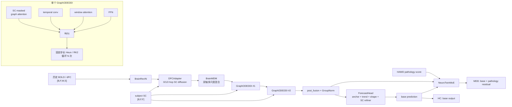
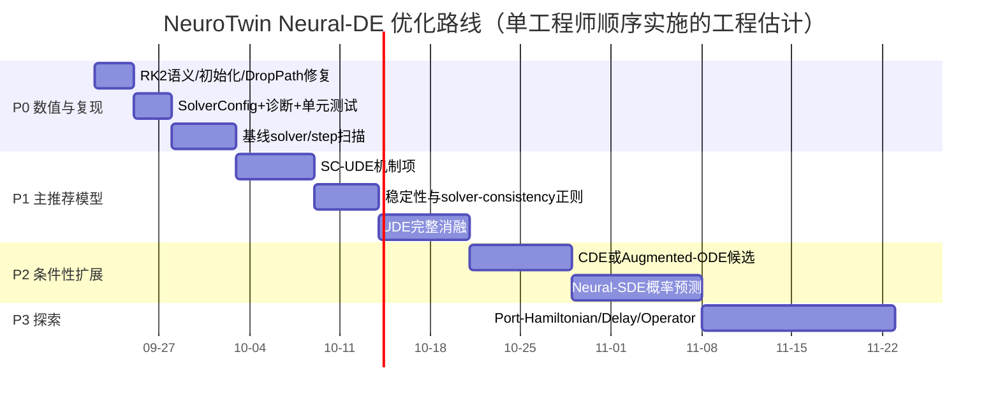

# NeuroTwin 神经微分方程组件：代码审计、文献定位与优化路线

## 执行摘要

截至本次审阅的 `main` 分支快照，NeuroTwin 的神经微分方程核心位于 `models/common.py` 的 `GraphODE` 与 `GraphODEDDI`，并由 `models/neurotwin.py` 在编码主干中堆叠调用。模型以 `[B, ROI, history_window, within_window_time]` 为状态张量，通过 **SC 约束图注意力 + 局部时间卷积 + 跨窗口注意力 + FFN** 构造向量场，再以手写固定步长 Heun/RK2 做多步更新；默认实验配置通常是 `n_block=2`、`ode_steps=6`、`ode_hidden_dim=256`。fileciteturn8file0L2-L2 fileciteturn9file0L2-L2 fileciteturn13file0L2-L2

**核心判断：当前 `GraphODEDDI` 更准确的定位是“共享参数的连续深度图时空 RK2 残差块”，而不是已经建立了明确物理时间语义的脑动力学 Neural ODE。** 原因是其积分状态包含完整的 `W×S` 历史张量，`GraphODE.forward(t, …)` 直接忽略 `t`，积分轴没有绑定 BOLD 的 TR、真实窗口时间或未来预测时间。因此它仍然可以是合理且有效的连续深度网络，但目前尚不足以把性能收益解释为“恢复真实连续脑动力学”。Neural ODE 原始工作强调的是学习状态导数并由数值求解器产生连续深度轨迹；Graph Neural ODE 则提供了把图结构纳入连续深度动力学的直接理论背景。fileciteturn8file0L2-L2 citeturn19academia0turn22academia2

本次审计发现四个优先级高于“换更复杂模型”的问题。第一，`GraphODEDDI` 将可学习 `step_scale` 只乘到最终 RK2 更新，而第二 stage 仍使用未缩放的 `dt`；若 `step_scale` 被解释为有效积分步长，这并不是一致的 Heun 离散。第二，ODE 内部的 stochastic depth 会随机跳过**积分步骤**，使训练期数值轨迹和推理期轨迹具有不同的求解语义。第三，所谓零初始化的 `ode_block_scales` 实际经过 `sigmoid(0)=0.5`，所以初始 ODE 块并非接近恒等映射。第四，代码没有 solver 抽象、`rtol/atol`、NFE、步长收敛或 stiffness 诊断；因此无法判断 `ode_steps=6` 是数值上足够，还是仅仅成为一个经验网络深度。fileciteturn8file0L2-L2 fileciteturn10file0L2-L2

**最推荐的算法升级不是直接上 Neural SDE、Hamiltonian Net 或 FNO，而是把 NeuroTwin 改造成 SC-guided UDE（Universal Differential Equation）：**

\[
\frac{dh}{d\tau}
=
-\kappa(h,\tau)L_{\mathrm{SC}}h
+r_\theta(h,\mathrm{SC},\tau),
\qquad
\kappa=\operatorname{softplus}(\kappa_{\rm raw})\ge0.
\]

即将 SC 图拉普拉斯扩散作为显式、可审计的耗散结构项，神经网络只拟合机制无法解释的残差。这比“SC 仅作为 attention hard mask/bias”更接近科学机器学习中的机制—数据混合范式，也更适合当前小样本、强结构先验的脑网络场景。UDE 原始工作正是把已知方程结构与可学习项组合，同时支持随机项、延迟、隐式约束和 stiff 系统。citeturn21academia2

推荐路线为：**P0 数值语义和基准修正 → P1 SC-UDE + 稳定性正则 → P2 按数据特征选择 CDE/SDE/Latent ODE → P3 才探索 Port-Hamiltonian、delay、Koopman、operator learning。** 若仅有规则采样的 6×30 历史窗，Neural CDE/Latent ODE 的核心优势——不规则观测和连续时间插值——并未充分发挥；Neural SDE 则应以概率预测和不确定性校准为目标，而非单纯期望提高 PCC。citeturn19academia1turn19academia2turn20academia0turn20academia2

工程上建议用约 **3–5 人日**完成 P0，约 **2–3 周**完成 P1 的实现与基础消融，P2 每条候选约 **1–3 周**；这些是单工程师的人力估计，不包含训练排队和数据清洗。相比立即重写整个模型，P0/P1 的信息增益和风险收益比最高。

## 调研补充：从哪些方面改进优化

将上述文献调研和代码审计归纳后，NeuroTwin 的神经微分方程不应被理解为“选择一个更复杂的 ODE/SDE 名称”，而应沿着以下 **六个维度**逐层优化。前两个维度决定当前模块是否真的具有可信的微分方程语义；后三个维度才决定模型能力边界；最后一个维度保证结论可复现。

| 优化维度 | 当前主要缺口 | 推荐改进 | 预期收益 | 优先级 |
|---|---|---|---|---|
| **1. 数值积分语义** | `step_scale` 与 Heun 第二 stage 不一致；积分步被 stochastic depth 随机跳过；没有步数收敛证据 | 统一有效步长、将 DropPath 移到完整 ODE block 外、比较 Euler/RK2/RK4/DOPRI5 与 `{1,2,3,6,12}` steps | 明确收益是否来自连续积分，而非碰巧加深网络；提高训练/推理一致性 | **P0** |
| **2. 时间轴与状态定义** | 当前积分变量是 depth time，不等于 TR 或 BOLD 真实时间；状态还包含整段历史 `[F,W,S]` | 短期明确以 `τ∈[0,1]` 表示连续深度；只有传入 timestamp、`Δt`、mask 后，才把模型升级为真实连续时间编码器 | 避免不成立的生理解释；为后续跨 TR、不规则采样奠定接口 | **P0/P2** |
| **3. SC 的机制化使用** | SC 在多个位置被重复作为 hard mask/bias，既可能过平滑，也无法表示条件性功能边 | 从“SC 约束 attention”转为 `-κL_SC h + residual` 的 SC-UDE；以低秩 `A_func` 作为可控功能残差图，并学习 SC/功能图混合系数 | 保留结构先验，同时允许状态依赖的功能耦合；SC 贡献可消融、可审计 | **P1** |
| **4. 稳定性与长程泛化** | 只有单窗点预测损失，未限制高速、刚性或扰动放大的向量场 | 依次加入 velocity/curvature penalty、小扰动 Lipschitz loss、`N↔2N` solver-consistency；先监测再考虑 Jacobian 正则、IMEX | 减少轨迹爆炸与 solver 敏感性，提高多步 rollout 的可靠性 | **P1** |
| **5. 按数据条件扩展方程类别** | 当前规则采样数据不足以证明 CDE、SDE、DDE 的必要性 | 不规则/缺失观测用 CDE；有不确定性目标时用 SDE/ensemble；有 tract length、TR 和观测模型时才尝试 DDE/神经质量 UDE | 使模型复杂度与可观测数据相匹配，避免不可辨识参数 | **P2/P3** |
| **6. 评价、可复现与可解释性** | 波形 PCC/MAE 不代表 FC 拓扑正确；分析仍有 validation/test 和滑窗独立性风险 | 增加 FC/dFC 指标、NFE/耗时/轨迹范数、subject-level CI、固定 test 和多 seed；报告 `κ`、图混合系数与稳定性统计 | 让“改进”可证伪、可复现，避免把模型敏感性误写成临床生物标志物 | **P0 全程** |

### 推荐的总体演进路径

```text
先验证数值正确性与 ODE 是否必要
    ↓
把 SC 写成显式、受约束的动力学机制项（SC-UDE）
    ↓
用稳定性/solver-consistency 约束筛掉不可靠的向量场
    ↓
根据数据是否存在时间不规则、传播延迟或概率预测目标，选择 CDE / DDE / SDE
    ↓
以被试级、FC 级、长 rollout 和数值级证据决定是否保留升级
```

这里的首选主线是：

\[
\frac{dh}{d\tau} = -\kappa\,L_{\rm SC}h + r_\theta(h,\mathrm{SC},\tau),
\]

其中第一项是非负扩散强度控制的、可解释的结构耦合，第二项只学习 SC 机制未覆盖的残差。若需要动态功能连接，再以低秩 `A_func` 作为该残差的一部分，而不是直接释放完整的 `116×116` 自由邻接矩阵。该路线与 UDE 的“机制项 + 可学习项”思想一致，也符合当前小样本、SC 强先验的约束。citeturn21academia2turn24academia0

### 选择各类方程的简单准则

| 数据/目标条件 | 首选路线 | 当前是否应优先做 |
|---|---|---|
| 规则采样、固定 6×30 历史、单步/短程预测 | 修正 RK2 + SC-UDE + 稳定性正则 | **是** |
| 真实不等间隔、缺失帧、变长扫描或任意时间查询 | Neural CDE / Latent ODE | 有对应数据后再做 |
| 需要输出置信区间、多种未来轨迹或风险量化 | ensemble/异方差预测 → Neural SDE | 先做前者 |
| 有 tract length、传导速度、TR、latent-to-BOLD 观测模型 | Delay UDE / 神经质量模型 | 高风险探索 |
| 多 atlas、任意空间/时间函数查询 | DeepONet / Graph Neural Operator | 长期方向 |

## 仓库审计：实现、接口与数值语义

当前递归树中，神经 DE 的直接实现和调用集中在少量文件；同时没有看到独立 `tests/`、`requirements.txt`、`pyproject.toml` 或环境锁文件，因此论文级复现和 solver 单元测试仍有明显基础设施缺口。项目已有专门的神经微分方程调研文档，并非“完全没有文档”，但代码级 solver contract、时间语义和数值验证仍不充分。fileciteturn3file0L2-L2 fileciteturn18file0L2-L2

### 组件、接口与问题表

| 组件 | 当前实现与接口 | 关键参数 | 审计结论 / 问题 |
|---|---|---|---|
| `models/common.py::prepare_sc_matrix` | 输入 SC `[F,F]` 或 `[B,F,F]` 与状态 `[B,F,W,S]`；SC 对称化、截负、加 self-loop，并产生 \(D^{-1/2}AD^{-1/2}\) | `eps≈1e-6` | 接口清晰；但后续不同模块分别再次处理 SC，缺少统一的“结构图定义”对象，容易产生预处理语义漂移。fileciteturn7file0L2-L2 |
| `DFCAdapter` | SC 与全局可学习 `F×F` edge weights 相乘，混合 0/1/2-hop 图传播，再经 SE gate 和 residual blend | `alpha≈0.5` | 对 AAL116 尚可，但 `F²` 自由边参数难扩展到高分辨率 atlas；建议低秩或稀疏动态残差图。fileciteturn7file0L2-L2 |
| `GraphODE` | `forward(t,h,sc) -> dh_dt`；`h=[B,F,W,S]`；四路：SC 图注意力、局部 temporal conv、window self-attention、FFN | `hidden_dim`、`num_heads=4`、`window_heads=5`、dropout | `t` 被直接丢弃，是自治向量场；合法，但没有物理时间/TR 语义。四个 gate 参数从 0 初始化，经 sigmoid 后实际权重均为 0.5。fileciteturn8file0L2-L2 |
| `GraphODEDDI` | 固定步长手写 Heun/RK2：循环 `ode_steps` 次 | 内部默认 `step_scale=0.1`、`ode_steps=5`；上层实验常传 `ode_steps=6` | 无 adaptive solver、`rtol/atol`、NFE、stiffness 检查；`step_scale` 与第二 stage 不一致；stochastic depth 在 solver step 内。fileciteturn8file0L2-L2 |
| `NeuroTwin._encode` | DFCAdapter → BrainMDM → `GraphODEDDI × n_block` → post fusion | 默认 `n_block=2`、CLI `ode_hidden_dim=256`、`ode_steps=6` | ODE 外又有 `sigmoid(ode_block_scale)` 残差缩放；raw 参数虽为 0，但初始有效缩放是 **0.5**，并非“零贡献”。fileciteturn10file0L2-L2 |
| `NeuroTwin.forward` | `(dfc_data, sc_matrix, pathology_score) -> (prediction, aux_info)` | RevIN 可选 | HC 阶段使用 base predictor；MDD 阶段在 base prediction 上叠加 pathology-conditioned MoE residual。ODE 主干两阶段共享。fileciteturn10file0L2-L2 |
| `virtual_intervention` | 在 BrainMDM 后、ODE 前对目标 ROI latent 做增益/抑制/方差操作 | ROI、类型、intensity | 是方便的反事实敏感性接口，但目前是**模型内干预**而非经识别的因果效应；不应直接等同于神经刺激因果预测。fileciteturn10file0L2-L2 |
| `main.py` | HC pretrain / MDD finetune，共用 AMP、EMA、AdamW、warmup+cosine、grad clipping、early stop | CLI 约 60 项 | device 硬编码成 `cuda:1`；训练仅显式取 train/val，未在训练入口完成 held-out test；没有 solver/method/tolerance/step-scale CLI。fileciteturn11file0L2-L2 fileciteturn12file0L2-L2 |
| `train/losses.py` | PCC + MAE + 一阶差分 + std，同方差不确定性自动加权 | log-var 范围 `[-6,6]` | 对点预测合理，但没有向量场速度、Jacobian、solver consistency、结构 FC 等 ODE 专属约束。fileciteturn15file0L2-L2 |
| `utils/dataloader.py` | subject-level train/val/test；HC/MDD；SC 预处理；规则滑窗 | 常用 `F=116,W=6,S=30` | 数据划分逻辑比许多时序项目更严谨；但真实时间戳/TR 没进入模型接口，因此目前不支持真正的 irregular-time DE。fileciteturn16file0L2-L2 fileciteturn19file0L2-L2 |
| `experiments/evaluate_variant.py` | checkpoint 后做评估、ROI importance、HAMD/MoE 分析、可视化（已合并原 `analysis/run_comprehensive.py`） | ODE 只暴露 steps/hidden/stochastic depth | 分析入口按 checkpoint 内的训练配置快照重建模型，无需手工同步超参；默认在被试级 8:1:1 留出的 test 集评估（`--splits` 可显式加 val）。 |

### 当前 RK2 实际做了什么

设 `N=ode_steps`、\(\Delta\tau=1/N\)、\(s=\mathrm{softplus}(\text{step\_scale\_raw})\)，现有代码相当于：

\[
k_1=f_\theta(h_n),\qquad
k_2=f_\theta(h_n+\Delta\tau k_1),
\]

\[
h_{n+1}
=
h_n+
s\,\frac{\Delta\tau}{2}(k_1+k_2).
\]

随后 `NeuroTwin` 外层又做：

\[
x\leftarrow x+
\sigma(a_{\rm block})
\left[\Phi_{\rm RK2}(x)-x\right].
\]

代码中的 `step_scale` 默认值没有由 `NeuroTwin` 显式传入，因此实际继续采用 `GraphODEDDI` 的默认 `0.1`；与此同时 block raw scale 初始化为 0，故 \(\sigma(a_{\rm block})=0.5\)。fileciteturn8file0L2-L2 fileciteturn10file0L2-L2

若 \(s\)  intended to represent 有效积分速度/步长，更一致的 Heun 应是：

\[
\delta\tau=\frac{s}{N},\qquad
k_1=f_\theta(\tau_n,h_n),
\]

\[
k_2=f_\theta(\tau_n+\delta\tau,h_n+\delta\tau k_1),
\qquad
h_{n+1}=h_n+\frac{\delta\tau}{2}(k_1+k_2).
\]

另一种更干净的选择是**完全去掉 solver 内 `step_scale`**，固定积分区间 \([0,1]\)，只保留 ODE block 外的 residual gate；这会减少不可辨识的双重缩放。



### 训练和推理链路

HC 预训练脚本当前实际只运行 `pred_window=1`，典型配置为 `batch_size=32`、`epochs=150`、`n_block=2`、`ode_steps=6`、`ode_hidden_dim=256`、`dropout=0.2`、EMA 0.999；MDD 微调沿用相同 ODE 配置，并前 10 个 epoch 冻结 backbone，再以 `backbone_lr_scale=0.2` 联合微调。值得注意的是，`main.py` 的 `pred_window` 默认值为 3，而两个 shell 脚本当前都只训练 1-window，因此“默认模型能力”与“当前实际实验脚本”应在文档中明确区分。fileciteturn12file0L2-L2 fileciteturn13file0L2-L2 fileciteturn14file0L2-L2

## 文献脉络与对 NeuroTwin 的启示

以下优先选择原始论文。该领域最权威的一手材料目前主要为英文论文；对于核心算法，不建议为了“中文来源优先”而用二手中文博客替代原论文。论文旁同时给出可用的开源实现入口。

| 方向 / 代表工作 | 方法、优势与局限 | 对 NeuroTwin 的适配判断 | 论文 / 代码 |
|---|---|---|---|
| **Neural ODE — Chen et al., 2018** | 用 NN 参数化 \(dh/dt\)，由 ODE solver 决定连续深度；可通过 solver 精度—速度权衡。优势是连续深度和求解器可控；缺点是 NFE、数值误差和 adjoint 误差可能成为训练成本。citeturn19academia0 | **必读 / P0**。NeuroTwin 已采用其“共享向量场+积分”形式，但尚缺 solver tolerance、NFE、收敛性诊断。 | [Paper](https://arxiv.org/abs/1806.07366) · [torchdiffeq](https://github.com/rtqichen/torchdiffeq) |
| **Augmented Neural ODE — Dupont et al., 2019** | 在状态中加入额外维度，缓解普通 NODE 的拓扑表达限制；原论文报告更好的稳定性、泛化和计算表现。citeturn19academia3 | **P2 候选**。若实验证明当前 `[F,W,S]` latent 存在表达瓶颈，可加小型 augmentation channel；不应在 P0 前先加复杂度。 | [Paper](https://arxiv.org/abs/1904.01681) · [Code](https://github.com/EmilienDupont/augmented-neural-odes) |
| **Latent ODE — Rubanova et al., 2019** | 用 ODE-RNN/latent variable 建模任意时间间隔观测；适合 irregularly sampled data 和生成式建模。citeturn19academia1 | **条件性 P2**。只有拿到真实时间戳、变长扫描或缺失观测后价值明显；对固定 6×30 窗并非天然优于当前模型。 | [Paper](https://arxiv.org/abs/1907.03907) · [Code](https://github.com/YuliaRubanova/latent_ode) |
| **Neural CDE — Kidger et al., 2020** | ODE 轨迹主要由初值决定，而 CDE 允许后续观测路径持续驱动隐藏状态；特别适合部分观测、不规则多变量时序。citeturn19academia2 | **数据条件满足时优先于 Latent ODE**。若未来 BOLD 时间戳不齐或存在缺失，CDE 与“观测持续驱动脑状态”更加匹配。 | [Paper](https://arxiv.org/abs/2005.08926) · [torchcde](https://github.com/patrick-kidger/torchcde) |
| **Graph Neural ODE — Poli et al., 2019** | 将 GNN 推广为连续深度图动力学，使图拓扑直接进入微分方程。citeturn22academia2 | **直接相关**。NeuroTwin 应将自身更明确定位在 GDE/graph-NODE，而非通用 NODE；SC 的机制作用应进一步显式化。 | [Paper](https://arxiv.org/abs/1911.07532) |
| **Scalable gradients for Neural SDE — Li et al., 2020** | 将 adjoint 方法推广到 SDE，并提供适应性 solver 与内存高效噪声处理。citeturn20academia0 | **P2/P3**。适合将脑动态中的不可解释波动建模为 diffusion，而不是靠 dropout 近似随机动力学。 | [Paper](https://arxiv.org/abs/2001.01328) · [torchsde](https://github.com/google-research/torchsde) |
| **Neural SDE as time-series generator — Kidger et al., 2021** | drift/diffusion 均可学习，以 Brownian motion 驱动连续时间生成路径，并结合 CDE discriminator。citeturn20academia2 | 只有当目标升级为**概率数字孪生、多模态未来、不确定性区间**时才值得投入；点预测 PCC 未必提高。 | [Paper](https://arxiv.org/abs/2102.03657) · [torchsde](https://github.com/google-research/torchsde) |
| **Hamiltonian Neural Networks — Greydanus et al., 2019** | 将能量守恒作为结构归纳偏置，可得到时间可逆、守恒的动力学。citeturn20academia3 | **低优先级**。BOLD/神经血管系统显著耗散，纯 Hamiltonian 假设偏强；适合作为方法学对照而非主模型。 | [Paper](https://arxiv.org/abs/1906.01563) · [Code](https://github.com/greydanus/hamiltonian-nn) |
| **Symplectic ODE-Net — Zhong et al., 2019** | 将 Hamiltonian inductive bias 与控制输入结合，适合机械系统并可识别质量/势能等量。citeturn20academia1 | 对真实脑 BOLD 不宜直接套用，但其“结构化动力学 + 外部 control”思想可借鉴到刺激/药物干预模块。 | [Paper](https://arxiv.org/abs/1909.12077) |
| **Port-Hamiltonian NN — Desai et al., 2021** | 在 Hamiltonian 基础上允许耗散和显式时变外力，适合非自治、非守恒系统。citeturn24academia2 | **比纯 HNN 更值得脑模型研究**。可将病理/干预视为 port input、耗散矩阵显式约束；但需有生理可解释状态。 | [Paper](https://arxiv.org/abs/2107.08024) |
| **DeepONet — Lu et al., 2019/2021** | branch net 编码输入函数，trunk net 编码查询位置，学习“函数→函数”的非线性 operator。citeturn21academia3 | 若任务变成“给定整个 SC/初始场/刺激函数，查询任意未来时间或空间位置”，比目前固定 window forecaster 更有吸引力。 | [Paper](https://arxiv.org/abs/1910.03193) · [Code](https://github.com/lululxvi/deeponet) |
| **Fourier Neural Operator — Li et al., 2020** | 在 Fourier 域参数化 operator kernel，用于一族 PDE 解映射，并支持跨网格泛化。citeturn21academia0 | **当前优先级低**：AAL116 是非规则脑图而非欧式规则网格；若扩展到体素/皮层场，可考虑 Graph/Geometric Neural Operator，而不是直接 FNO。 | [Paper](https://arxiv.org/abs/2010.08895) · [NeuralOperator](https://github.com/neuraloperator/neuraloperator) |
| **PINN — Raissi et al., 2017/2019** | 将已知 PDE 残差写入 loss，用数据与物理方程共同约束网络。citeturn21academia1 | 不建议“为了 physics-informed 而强加 PINN”。NeuroTwin 当前没有公认的 BOLD governing PDE；错误物理约束比无约束更危险。 | [Paper](https://arxiv.org/abs/1711.10561) · [Code](https://github.com/maziarraissi/PINNs) |
| **Universal Differential Equations — Rackauckas et al., 2020** | 将已知动力学项和神经未知项放在同一微分方程中，支持随机性、延迟、隐式约束和 stiff 系统。citeturn21academia2 | **本报告首选 P1**。SC 图扩散是已知结构项，NN 学 residual，比全黑盒 `GraphODE` 更容易做消融和解释。 | [Paper](https://arxiv.org/abs/2001.04385) · [Examples](https://github.com/ChrisRackauckas/universal_differential_equations) |
| **Jacobian / kinetic regularization — Finlay et al., 2020** | 用轨迹速度和 Jacobian 类正则偏向更简单、更易求解的 NODE dynamics，可降低 solver 工作量。citeturn22academia0 | **P1 强推荐**。尤其适合 NeuroTwin 检查 ODE 块是否靠剧烈高频向量场拟合训练数据。 | [Paper](https://arxiv.org/abs/2002.02798) |
| **Easy-to-solve DE — Kelly et al., 2020** | 直接惩罚使 solver 成本变高的高阶轨迹行为，在精度与求解成本间优化。citeturn22academia1 | 推荐作为 NFE/solver-consistency 优化参考，而非单纯把 `ode_steps` 固定为经验常数。 | [Paper](https://arxiv.org/abs/2007.04504) · [Code](https://github.com/jacobjinkelly/easy-neural-ode) |
| **Stiff Neural ODE — Kim et al., 2021** | 系统研究尺度分离和 stiffness 导致的训练困难，强调输出尺度、loss scaling 和稳定梯度的重要性。citeturn22academia3 | 先做 stiffness 诊断；只有显式 solver 需要极小步长、Jacobian 谱存在明显尺度分离时才上 implicit/IMEX。 | [Paper](https://arxiv.org/abs/2103.15341) |
| **Stable Neural Flows — Massaroli et al., 2020** | 以能量函数构造具有渐近稳定保证的 neural flow，并降低输入扰动放大和 solver 负担。citeturn24academia0 | 可作为 SC-UDE 的稳定化参考，尤其用于多步 rollout；首版无需整体替换网络。 | [Paper](https://arxiv.org/abs/2003.08063) |
| **Neural DDE — Zhu et al., 2021** | 在连续动力学中显式使用延迟状态 \(x(t-\tau)\)，提升有记忆和传播延迟系统的表达力。citeturn24academia1 | 脑网络理论上很契合传播延迟；但只有获得 tract length、传导速度或可靠 delay proxy 后才应尝试。 | [Paper](https://arxiv.org/abs/2102.10801) |

数值工具方面，PyTorch 原生路线最直接的是 `torchdiffeq`：它提供 `dopri5/dopri8/bosh3/adaptive_heun` 等 adaptive 方法以及 Euler、midpoint、RK4、Adams 等固定步方法，同时暴露 `rtol`、`atol` 和 adjoint 接口；官方说明也指出 `dopri5` 或合理小步长的 RK4 是常见选择。citeturn23search0turn23search1 Diffrax 则覆盖 ODE/SDE/CDE、implicit 与 symplectic solver；SciML/DifferentialEquations.jl 进一步覆盖 split/partitioned ODE、IMEX、SDE、DDE 等，适合作为 stiff/split-system 的研究参考。citeturn23search3turn23search5

对 NeuroTwin 而言，这并不意味着必须引入外部 solver 作为最终部署依赖。更合理的做法是：**训练部署继续保留简单、GPU 友好的固定步 RK2/RK4，而把 DOPRI5 作为数值“参照尺”**，用于检验固定 6 步是否已经足够准确。

## 跨领域可迁移模型

下面的迁移重点不是“把别的领域方程原封不动搬到脑科学”，而是借用其**结构约束、可辨识参数化和求解策略**。

| 来源领域 | 候选方程 / 技术 | 对 NeuroTwin 的迁移方式 | 价值与主要风险 |
|---|---|---|---|
| **控制 / 系统辨识** | Koopman latent dynamics | 学编码 \(z=\phi(x)\)，使 \(dz/dt\approx Kz+r_\theta(z)\)，或作为纯线性 latent baseline | Koopman 方法的核心价值是寻找使非线性动力学近似线性的低维坐标，从而便于预测、稳定性分析和控制。适合 NeuroTwin 建立“是否真的需要复杂 NODE”的强 baseline。citeturn23academia37 |
| **控制** | Port-Hamiltonian | \( \dot h=[J(h)-R(h)]\nabla H(h)+G(h)u(t) \)，其中 \(R\succeq0\) 表示耗散 | 可将刺激、药物、病理条件放进 \(u(t)\)，比纯 HNN 更适合耗散脑系统；风险是 latent energy 未必具有生理可辨识性。citeturn24academia2 |
| **控制 / irregular sensing** | Controlled DE | \(dh=f_\theta(h)\,dX(t)\) | 当 BOLD/临床观测存在不等间隔和缺失时，用插值观测路径持续驱动 state，比把全部历史压成初值更自然。citeturn19academia2 |
| **计算物理** | Graph diffusion / reaction–diffusion | \(\dot h=-\kappa L_{\rm SC}h+r_\theta(h)\) | **最高推荐**。SC 天然定义图 Laplacian；耗散扩散项稳定、可解释，NN 只补未知动力学，符合 UDE 范式。citeturn21academia2 |
| **计算物理** | Split / IMEX integration | 刚性的线性图扩散隐式求解，神经 residual 显式求解 | 若 \(-\kappa Lh\) 与 neural residual 时间尺度明显分离，可避免 explicit solver 被最稳定步长限制；SciML 已提供成熟 split/IMEX 方法作为参考。citeturn23search5 |
| **传播 / 波动力学** | Delay DE | \(\dot h_i(t)=f_i(h_i)+\sum_j A_{ij}g(h_j(t-\tau_{ij}))\) | SC + tract length 可产生传播 delay；没有可靠 \(\tau_{ij}\) 时不要凭网络自行“发现生理传导速度”。Neural DDE 显示 delay 本身能提升非 Markov dynamics 表达能力。citeturn24academia1 |
| **流行病学** | SIR/SEIR compartment flow | 借鉴**非负转移率、状态流守恒、少量可解释参数**，而非直接把脑区当 S/I/R | 若未来建立 E/I、兴奋/抑制或健康/病理 latent compartments，可用 constrained flow 替代无结构 MLP；目前应视为设计范式，不是生理定律。UDE 可自然容纳这种“已知 compartment + unknown neural term”的混合形式。citeturn21academia2 |
| **金融 / 随机动力学** | OU / Heston 风格 mean-reverting SDE | \(dh=\{\kappa(\mu-h)+r_\theta(h)\}dt+g_\phi(h)dW_t\) | 可把 BOLD 的随机波动从 epistemic/dropout 中分离出来，输出路径分布和预测区间；需要 CRPS/NLL/coverage，而不仅 PCC。Neural SDE 已提供可微 drift/diffusion 学习框架。citeturn20academia0turn20academia2 |
| **算子学习** | DeepONet / Neural Operator | 学 \((SC,\text{history},u(\cdot))\mapsto y(t,\text{ROI})\) 的函数算子 | 当目标扩展到任意时间查询、不同 atlas/resolution 或多种 stimulation functions 时有价值；当前固定 AAL116 单步预测无需优先投入。citeturn21academia3turn21academia0 |

其中最有价值的跨域迁移实际上是**“反应扩散 + UDE + 控制输入”组合**：

\[
\boxed{
\frac{dh}{d\tau}
=
-\kappa(h)\,L_{\mathrm{SC}}h
+
r_\theta(h,A_{\rm func})
+
B_\phi(h)u(\tau)
}
\]

这里 \(L_{\rm SC}\) 提供结构机制，\(r_\theta\) 学未建模生理，\(u(\tau)\) 可在未来接临床评分、刺激或药物条件。它比当前“四个黑盒分支求和后叫 `dh_dt`”更容易回答：**SC 到底贡献了什么、病理改变的是扩散强度还是残差动力学、模型是否稳定。**

## 优化方案与路线图

### 优先路线

| 优先级 | 建议修改 | 具体实现 | 人力估计 | 风险 |
|---|---|---|---:|---|
| **P0 — 数值正确性** | 统一 RK2 语义 | 要么令 `effective_dt=softplus(step_scale_raw)/N` 并同时用于所有 Heun stages；要么删除 solver 内 scale，只保留外层 residual gate | 0.5–1 日 | 低 |
| **P0 — 稳定初始化** | 修正“zero-init≠zero effect” | `ode_block_scale` 改为直接 zero scalar / `tanh(raw)`；或 sigmoid raw 初始化为 -4~-6，使初始贡献接近 0 | 0.5 日 | 低 |
| **P0 — stochastic depth 位置** | 从数值积分内部移出 | 不再随机跳 RK step；将 DropPath 放到完整 `GraphODEDDI` block 的外层 residual branch | 0.5 日 | 低 |
| **P0 — solver observability** | 增加统一 SolverConfig | `method, steps, t0,t1, rtol,atol, adjoint, step_scale`；记录 NFE、\(\|f\|\)、\(\|\Delta h\|\)、state norm、NaN/clip 次数 | 1–2 日 | 低 |
| **P0 — 工程基线** | 补 unit test / test split / device | 线性 ODE 和衰减 ODE 验证阶数；增加 `--device`；正式入口跑 held-out test；补环境锁文件 | 1–2 日 | 低 |
| **P1 — SC-UDE** | 机制项 + neural residual | `dh=-κ L_SC h + rθ(h,SC)`；κ 为非负可学习 scalar / ROI-wise gate；SC 仍 subject-specific | 4–6 日 | 中 |
| **P1 — 动态图降维** | 避免全量 \(F^2\) learned edges | `A=A_SC + UU^T`，rank 8/16；或在 SC top-k edges 上学习 residual edge weights | 2–4 日 | 中 |
| **P1 — 稳定性正则** | 控制速度/Jacobian/solver sensitivity | kinetic penalty、Hutchinson Jacobian penalty、小扰动 Lipschitz loss、N↔2N solution-consistency | 3–5 日 | 中 |
| **P1 — solver benchmark** | 固定与 adaptive 对照 | train：RK2/RK4；reference：DOPRI5；steps `{1,2,3,6,12}`；同时报告耗时/NFE/显存 | 2–3 日实现 + 实验 | 低 |
| **P2 — CDE** | 仅在真实 irregular/missing timestamps 存在时 | spline/interpolation + Neural CDE；把 SC graph vector field 嵌入 CDE | 1–2 周 | 中 |
| **P2 — Neural SDE** | 概率数字孪生 | drift 使用 SC-UDE，diffusion 用 diagonal/low-rank NN；多路径 Monte Carlo | 2–3 周 | 中高 |
| **P2 — Augmented/Latent ODE** | 表达/生成式扩展 | augmentation 先从 8–32 latent dims 做；Latent ODE 只在生成式/不规则数据实验 | 1–2 周 | 中 |
| **P3 — Port-Hamiltonian / DDE** | 结构化干预 / delay | 只有明确能量、耗散或 tract-delay 数据后开展 | 2–4 周/方向 | 高 |
| **P3 — Operator learning** | 多 atlas / 任意时刻查询 | Graph Neural Operator / DeepONet baseline | 3–5 周 | 高 |

### 推荐的 solver 策略

第一阶段不建议立刻把训练全部交给 adaptive solver。当前状态维度大致为 \(116\times6\times30\)，而向量场又包含 dense graph attention；adaptive method 的多次函数求值成本可能相当高。建议把**正确的固定步 RK2 或 RK4**保留为训练默认，并把 DOPRI5 当高精度 reference。`torchdiffeq` 已提供 DOPRI5、RK4、adaptive Heun 等方法和 `rtol/atol`，因此可以先实现一个兼容 backend，而不需要重写模型。citeturn23search0turn23search1

建议首轮 reference 配置从 `dopri5, rtol=1e-3, atol=1e-5` 开始，再用 `1e-4/1e-6` 做 sensitivity sweep；这些数值是**实验起点而非领域标准**。判断固定 6 步够不够的关键不是哪个 solver 的 PCC 更高，而是：

\[
\epsilon_{\rm solver}
=
\frac{\|\Phi_{N}(h)-\Phi_{\rm ref}(h)\|_2}
{\|\Phi_{\rm ref}(h)\|_2+\epsilon}
\]

是否随 N 增加稳定下降，同时 downstream performance 已经饱和。

若后续 SC-UDE 的图扩散项变得明显 stiff，则不应简单把 RK2 从 6 步增加到几十步，而应考虑 split/IMEX：将可分析的 \(-\kappa L_{\rm SC}h\) 用 implicit/exponential treatment，非线性 residual 用 explicit solver。Stiff NODE 文献说明尺度分离会显著影响训练稳定性，而 SciML 已覆盖 IMEX/split ODE 求解器。citeturn22academia3turn23search5

### 正则化建议

建议新增：

\[
L_{\rm vel}
=
\mathbb E_\tau\|f_\theta(h_\tau)\|_2^2,
\]

用于抑制不必要的高速 latent flow；以及局部扰动稳定性：

\[
L_{\rm stab}
=
\max\left(
0,\,
\frac{\|\Phi(h+\delta)-\Phi(h)\|}
{\|\delta\|+\epsilon}
-\gamma
\right)^2 .
\]

对 Jacobian 不必显式构造完整矩阵，可用随机向量的 Jacobian-vector product / Hutchinson estimator 做近似。Finlay 等表明 kinetic/Jacobian regularization 可以让 NODE 学到更简单、更容易被 solver 处理的 dynamics；Kelly 等则从“让方程更易求解”的角度建立了类似目标。citeturn22academia0turn22academia1

### 可扩展性建议

AAL116 上 dense ROI attention 尚可，但复杂度本质上至少包含 \(O(BWF^2)\) 的 graph attention。若未来扩展到 Schaefer-400/1000 或更细粒度 connectome，应优先把 SC 做成 edge-list/top-k sparse graph，并让 learnable graph 只在 SC 邻域或低秩 residual 上工作，而不是继续学习完整 `F×F` edge matrix。当前 `DFCAdapter` 已有全量 learned edge 参数，因此这个问题会随 atlas 分辨率平方增长。fileciteturn7file0L2-L2

在反向传播上，当前 `ode_steps≈6` 时直接 autograd 通常比为了“Neural ODE 正统性”强行使用 adjoint 更简单；只有当积分步数、状态长度或显存明显成为瓶颈时再启用 adjoint。`torchdiffeq` 的 adjoint 方法以额外反向 ODE solve 换取 O(1) solver-state memory，因此本质是内存—计算折中，而不是无条件更优。citeturn23search0



这里 P2/P3 应视 P0/P1 结果和数据条件决定是否执行，而不是强制串行开发清单。

## 实验设计与评估协议

### 最小但具有判别力的消融矩阵

首先必须回答“ODE 到底带来了什么”。建议保留相同 subject split、随机种子、epoch budget、forecast head 和 MoE，只有被研究因素改变。

| 组别 | 实验 | 要回答的问题 |
|---|---|---|
| **B0** | 当前仓库原样 | 可复现 reference |
| **B1** | 修正有效步长 RK2 | 当前 step-scale 数值不一致是否影响结果 |
| **B2** | B1 + DropPath 移到 ODE block 外 | solver 内随机跳步是否造成 train/eval mismatch |
| **B3** | `ode_steps=1` | 多步积分是否真的比一个共享 residual update 有价值 |
| **B4** | 完全移除 GraphODEDDI，参数量匹配 MLP/Graph block | 收益来自“连续积分”还是仅来自额外容量 |
| **B5** | Euler / RK2 / RK4 / DOPRI5 reference | 性能对 solver 是否敏感 |
| **B6** | RK2 steps `{1,2,3,6,12}` | 是否有数值收敛趋势 |
| **U0** | 纯 \(-κL_{\rm SC}h\) | SC diffusion 本身能解释多少 |
| **U1** | SC diffusion + local neural residual | 本报告主推荐 UDE |
| **U2** | U1 + low-rank dynamic graph residual | 是否需要 SC 之外的功能性连接 |
| **U3** | U2 + kinetic/Jacobian regularization | 更稳定 dynamics 是否改善泛化/求解成本 |
| **U4** | U3 + solver consistency loss | 是否能降低 train/eval solver sensitivity |
| **A1** | Augmented ODE | 当前 state topology 是否构成表达瓶颈 |
| **C1** | Neural CDE | 仅在构造/拥有 irregular-time benchmark 时跑 |
| **S1** | Neural SDE | 仅以概率质量和 calibration 为主要判断标准 |

其中最关键的负对照是 **B4**。如果参数量匹配的离散 graph residual block 与 Neural ODE 在 held-out subject 上没有显著差异，而 `ode_steps=1/3/6/12` 也无系统收敛收益，则论文中应把 `GraphODEDDI` 描述为“weight-shared graph dynamical block”，而不要把预测提升主要归因于连续时间建模。

### 指标体系

只报告 PCC/MAE 不足以证明一个 neural DE 的价值。建议建立五层指标：

**预测质量。** Subject-level PCC、MAE、RMSE、每 ROI PCC、每预测 horizon 的误差；保留当前一阶差分 MAE 和 std error。当前损失已经覆盖 PCC/MAE/diff/std，因此这些指标能直接与训练目标对应。fileciteturn15file0L2-L2

**脑网络结构质量。** 对真实和预测 BOLD 分别计算 FC/dFC，比较 edge-wise PCC、MAE/Frobenius norm、top-k edge overlap、network-level connectivity error。否则可能出现“波形 MAE 不大，但预测出的网络拓扑错误”的情况。

**数值质量。** 必须新增 `NFE`、forward latency、峰值显存、\(\|h(t)\|\)、\(\|f(h)\|\)、每步 \(\|\Delta h\|\)、gradient norm、gradient-clip 触发率、NaN/Inf 次数，以及：

\[
E_{N,2N}
=
\frac{\|\Phi_N(h)-\Phi_{2N}(h)\|}
{\|\Phi_{2N}(h)\|+\epsilon}.
\]

Neural ODE 的求解器精度—计算权衡正是该模型类的核心特征，而成熟工具都把 step method、tolerance 等作为一等配置。citeturn19academia0turn23search0

**稳定性和长 rollout。** 不能只做当前脚本的单未来窗口。至少分别评估 1、3、6 个未来窗口的 autoregressive/rollout degradation；对输入加小噪声或 SC 边 perturbation，测输出 amplification factor。Stable Neural Flow 等工作说明轨迹稳定性本身是连续动力系统模型的重要性质。citeturn24academia0

**概率质量，仅用于 SDE。** NLL、CRPS、50/80/95% prediction interval coverage、sharpness、calibration curve；否则“生成多个随机未来”没有可验证价值。Neural SDE 的核心能力是学习随机路径分布，而不是只替换确定性 ODE 的 point estimate。citeturn20academia0turn20academia2

### 数据划分与统计检验

现有 subject-level split 是正确方向：一个 subject 的多个滑窗不会跨 train/val/test，这能避免最危险的时序样本泄漏。fileciteturn16file0L2-L2 fileciteturn19file0L2-L2 但正式实验必须把当前分析流程从 validation 改为：**train 用于拟合，validation 用于 early stopping/超参选择，test 在配置锁定后只评一次。** 当前 `run_comprehensive.py` 获取的是 `val_data`，因此如果其输出用于最终论文指标，会产生模型选择偏乐观风险。fileciteturn24file0L2-L2

建议至少使用 5 个固定 seed，所有模型使用相同 subject split；报告 subject-level paired bootstrap 95% CI，而不是把大量 window samples 当作独立样本做显著性检验。主比较应以 subject 为统计单位，因为数据生成和划分本来就是 subject-level。

### 决策门槛

建议设三个阶段性 go/no-go 条件：

**P0 通过条件：** 修正后的 RK2 在预测指标上不显著劣于当前实现，同时 `N→2N` solver discrepancy 明显下降；`ode_steps`、state/derivative norm 和 NFE/耗时全部可观测。否则先不要开发更复杂 DE。

**P1 通过条件：** SC-UDE 在 held-out subjects 上至少满足“预测质量不劣于当前 GraphODE，同时 solver sensitivity 或长 rollout stability 有明确改善”；若 PCC 小幅提升但稳定性显著恶化，不建议替换。

**P2 通过条件：** CDE 必须在 irregular/missing-data benchmark 上证明价值；SDE 必须改善 CRPS/coverage 等概率指标；Augmented ODE 必须证明不是单纯增加参数带来的收益。

综合来看，NeuroTwin 当前已经具备一个相当完整的**图时空 Neural-ODE-like backbone**，真正缺少的不是更多模型名词，而是“连续动力学模型应有的可检验性”：时间轴定义、数值求解一致性、solver convergence、稳定性、机制项和 held-out 验证。Neural ODE、Graph Neural ODE 与 UDE 文献共同指向同一条更稳健的演进路线：**先让方程、solver 和 SC 的角色可被证伪，再增加 stochastic、controlled 或 Hamiltonian 等更强假设。** citeturn19academia0turn22academia2turn21academia2
